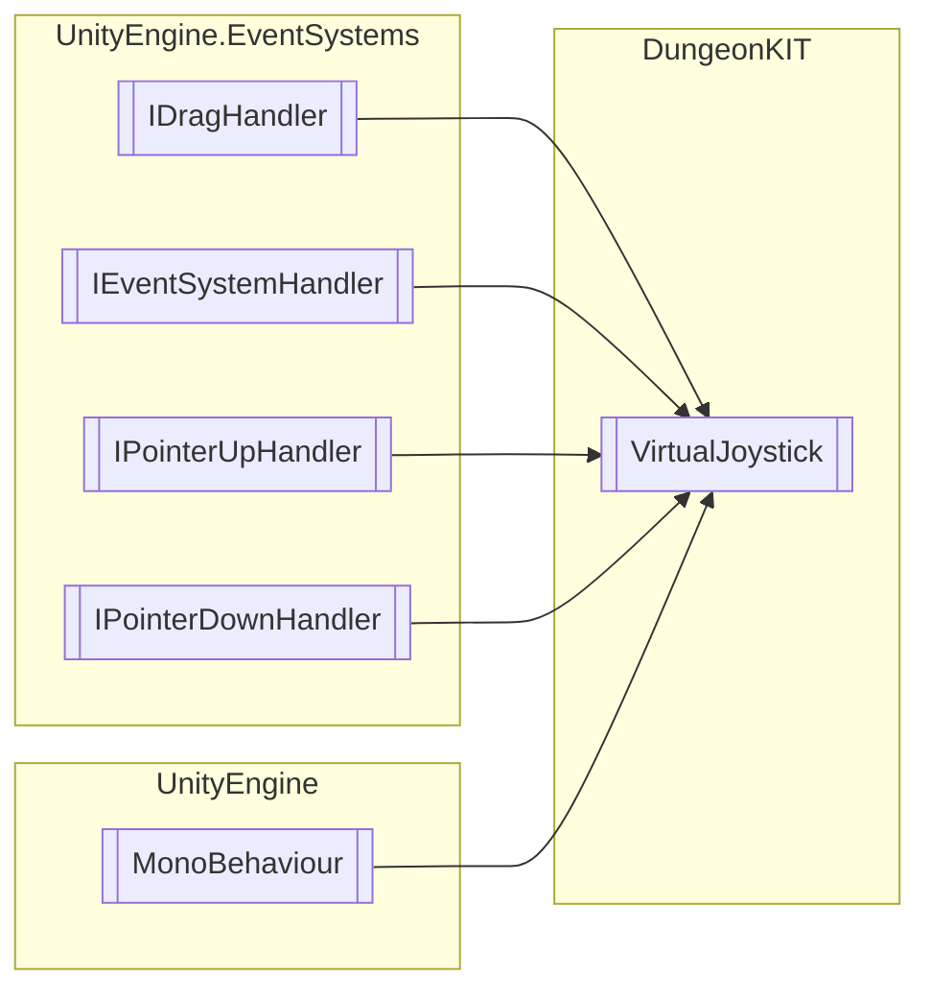

# VirtualJoystick `Public class`

## Diagram


## Members
### Methods
#### Public  methods
| Returns | Name |
| --- | --- |
| `void` | [`OnDrag`](#ondrag)(`PointerEventData` eventData) |
| `void` | [`OnPointerDown`](#onpointerdown)(`PointerEventData` eventData) |
| `void` | [`OnPointerUp`](#onpointerup)(`PointerEventData` eventData) |

## Details
### Inheritance
 - `IDragHandler`
 - `IEventSystemHandler`
 - `IPointerUpHandler`
 - `IPointerDownHandler`
 - `MonoBehaviour`

### Nested types
#### Enums
 - `JoystickType`

### Constructors
#### VirtualJoystick
```csharp
public VirtualJoystick()
```

### Methods
#### OnPointerDown
```csharp
public virtual void OnPointerDown(PointerEventData eventData)
```
##### Arguments
| Type | Name | Description |
| --- | --- | --- |
| `PointerEventData` | eventData |   |

#### OnDrag
```csharp
public virtual void OnDrag(PointerEventData eventData)
```
##### Arguments
| Type | Name | Description |
| --- | --- | --- |
| `PointerEventData` | eventData |   |

#### OnPointerUp
```csharp
public virtual void OnPointerUp(PointerEventData eventData)
```
##### Arguments
| Type | Name | Description |
| --- | --- | --- |
| `PointerEventData` | eventData |   |

*Generated with* [*ModularDoc*](https://github.com/hailstorm75/ModularDoc)
