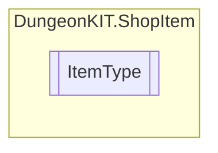

# ItemType `Public enum`

## Diagram

## Details
### Fields
#### bottle

#### keys

#### superheal

#### GStone

#### ATKUP

#### DEFUP

#### LittleHeart

#### ALLUP

#### SPEEDUP

#### HDJ

#### FL

#### SL

#### BOX

#### WL

#### GL

#### DRAGONHEART

#### MUSIC

#### StoneBOOK

#### BIGHERART

#### POISON

#### GOLD

*Generated with* [*ModularDoc*](https://github.com/hailstorm75/ModularDoc)
