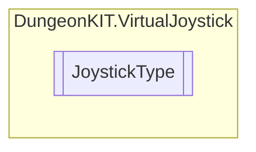

# JoystickType `Public enum`

## Diagram

```mermaid
  flowchart LR
  classDef interfaceStyle stroke-dasharray: 5 5;
  classDef abstractStyle stroke-width:4px
  subgraph DungeonKIT.VirtualJoystick
  DungeonKIT.VirtualJoystick.JoystickType[[JoystickType]]
  end
```

## Details
### Fields
#### Move

#### Attack

*Generated with* [*ModularDoc*](https://github.com/hailstorm75/ModularDoc)
