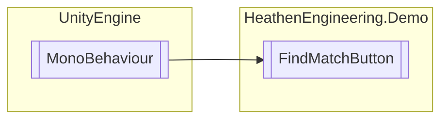

# FindMatchButton `Public class`

## Diagram


## Members
### Methods
#### Public  methods
| Returns | Name |
| --- | --- |
| `void` | [`GetHelp`](#gethelp)() |
| `void` | [`SimpleFindMatch`](#simplefindmatch)() |

## Details
### Inheritance
 - `MonoBehaviour`

### Constructors
#### FindMatchButton
```csharp
public FindMatchButton()
```

### Methods
#### SimpleFindMatch
```csharp
public void SimpleFindMatch()
```

#### GetHelp
```csharp
public void GetHelp()
```

*Generated with* [*ModularDoc*](https://github.com/hailstorm75/ModularDoc)
