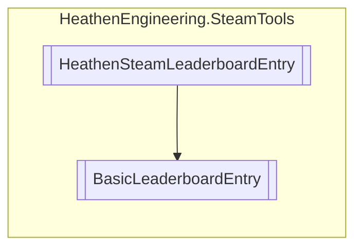

# BasicLeaderboardEntry `Public class`

## Diagram


## Members
### Methods
#### Public  methods
| Returns | Name |
| --- | --- |
| `void` | [`ApplyEntry`](#applyentry)([`ExtendedLeaderboardEntry`](./heathenengineeringsteamtools-ExtendedLeaderboardEntry) entry) |

## Details
### Inheritance
 - [
`HeathenSteamLeaderboardEntry`
](./heathenengineeringsteamtools-HeathenSteamLeaderboardEntry)

### Constructors
#### BasicLeaderboardEntry
```csharp
public BasicLeaderboardEntry()
```

### Methods
#### ApplyEntry
```csharp
public override void ApplyEntry(ExtendedLeaderboardEntry entry)
```
##### Arguments
| Type | Name | Description |
| --- | --- | --- |
| [`ExtendedLeaderboardEntry`](./heathenengineeringsteamtools-ExtendedLeaderboardEntry) | entry |   |

*Generated with* [*ModularDoc*](https://github.com/hailstorm75/ModularDoc)
