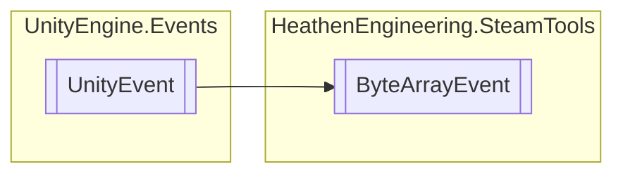

# ByteArrayEvent `Public class`

## Diagram


## Details
### Inheritance
 - `UnityEvent`&lt;`byte``[]`&gt;

### Constructors
#### ByteArrayEvent
```csharp
public ByteArrayEvent()
```

*Generated with* [*ModularDoc*](https://github.com/hailstorm75/ModularDoc)
