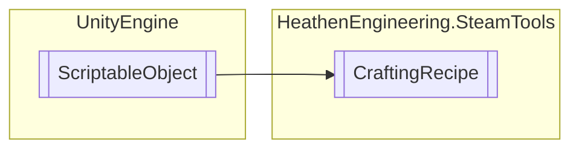

# CraftingRecipe `Public class`

## Diagram


## Details
### Inheritance
 - `ScriptableObject`

### Constructors
#### CraftingRecipe
```csharp
public CraftingRecipe()
```

*Generated with* [*ModularDoc*](https://github.com/hailstorm75/ModularDoc)
