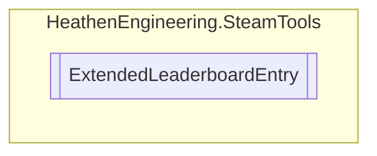

# ExtendedLeaderboardEntry `Public class`

## Diagram


## Details
### Constructors
#### ExtendedLeaderboardEntry
```csharp
public ExtendedLeaderboardEntry()
```

*Generated with* [*ModularDoc*](https://github.com/hailstorm75/ModularDoc)
