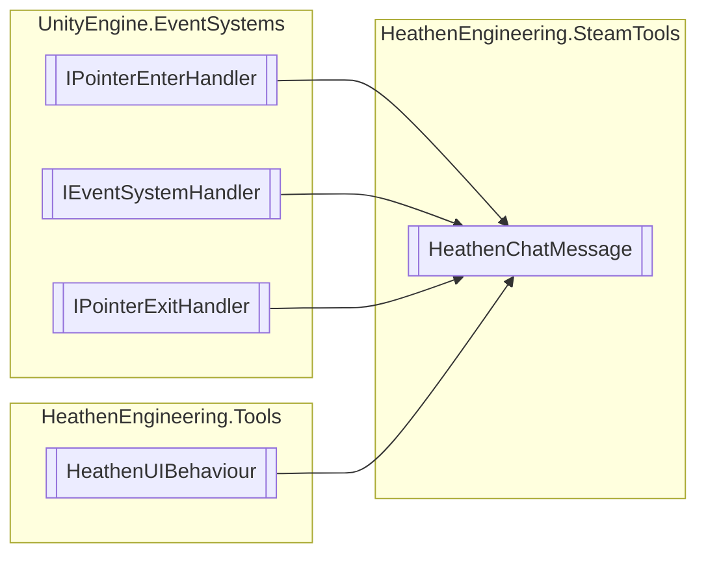

# HeathenChatMessage `Public class`

## Diagram


## Members
### Methods
#### Public  methods
| Returns | Name |
| --- | --- |
| `void` | [`OnPointerEnter`](#onpointerenter)(`PointerEventData` eventData) |
| `void` | [`OnPointerExit`](#onpointerexit)(`PointerEventData` eventData) |

## Details
### Inheritance
 - `IPointerEnterHandler`
 - `IEventSystemHandler`
 - `IPointerExitHandler`
 - `HeathenUIBehaviour`

### Constructors
#### HeathenChatMessage
```csharp
public HeathenChatMessage()
```

### Methods
#### OnPointerEnter
```csharp
public virtual void OnPointerEnter(PointerEventData eventData)
```
##### Arguments
| Type | Name | Description |
| --- | --- | --- |
| `PointerEventData` | eventData |   |

#### OnPointerExit
```csharp
public virtual void OnPointerExit(PointerEventData eventData)
```
##### Arguments
| Type | Name | Description |
| --- | --- | --- |
| `PointerEventData` | eventData |   |

*Generated with* [*ModularDoc*](https://github.com/hailstorm75/ModularDoc)
