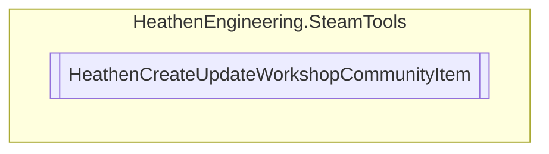

# HeathenCreateUpdateWorkshopCommunityItem `Public class`

## Diagram


## Members
### Properties
#### Public  properties
| Type | Name | Methods |
| --- | --- | --- |
| `bool` | [`HasAppId`](#hasappid) | `get` |
| `bool` | [`HasFileId`](#hasfileid) | `get` |

### Methods
#### Public  methods
| Returns | Name |
| --- | --- |
| `bool` | [`CreateAndUpdate`](#createandupdate)(`string` changeNote) |
| `EItemUpdateStatus` | [`GetItemUpdateProgress`](#getitemupdateprogress)(out `ulong` bytesProcessed, out `ulong` bytesTotal) |
| `bool` | [`Update`](#update)(`string` changeNote) |

## Details
### Constructors
#### HeathenCreateUpdateWorkshopCommunityItem [1/2]
```csharp
public HeathenCreateUpdateWorkshopCommunityItem(AppId_t targetApp)
```
##### Arguments
| Type | Name | Description |
| --- | --- | --- |
| `AppId_t` | targetApp |   |

#### HeathenCreateUpdateWorkshopCommunityItem [2/2]
```csharp
public HeathenCreateUpdateWorkshopCommunityItem(SteamUGCDetails_t itemDetails)
```
##### Arguments
| Type | Name | Description |
| --- | --- | --- |
| `SteamUGCDetails_t` | itemDetails |   |

### Methods
#### CreateAndUpdate
```csharp
public bool CreateAndUpdate(string changeNote)
```
##### Arguments
| Type | Name | Description |
| --- | --- | --- |
| `string` | changeNote |   |

#### Update
```csharp
public bool Update(string changeNote)
```
##### Arguments
| Type | Name | Description |
| --- | --- | --- |
| `string` | changeNote |   |

#### GetItemUpdateProgress
```csharp
public EItemUpdateStatus GetItemUpdateProgress(out ulong bytesProcessed, out ulong bytesTotal)
```
##### Arguments
| Type | Name | Description |
| --- | --- | --- |
| `out` `ulong` | bytesProcessed |   |
| `out` `ulong` | bytesTotal |   |

### Properties
#### HasFileId
```csharp
public bool HasFileId { get; }
```

#### HasAppId
```csharp
public bool HasAppId { get; }
```

*Generated with* [*ModularDoc*](https://github.com/hailstorm75/ModularDoc)
