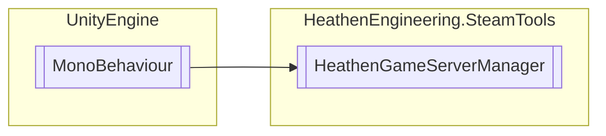

# HeathenGameServerManager `Public class`

## Diagram


## Members
### Methods
#### Public  methods
| Returns | Name |
| --- | --- |
| `void` | [`InitializeGameServer`](#initializegameserver)() |

## Details
### Inheritance
 - `MonoBehaviour`

### Constructors
#### HeathenGameServerManager
```csharp
public HeathenGameServerManager()
```

### Methods
#### InitializeGameServer
```csharp
public void InitializeGameServer()
```

*Generated with* [*ModularDoc*](https://github.com/hailstorm75/ModularDoc)
