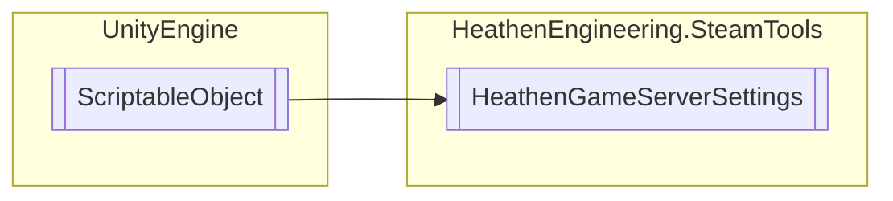

# HeathenGameServerSettings `Public class`

## Diagram


## Members
### Methods
#### Public  methods
| Returns | Name |
| --- | --- |
| `void` | [`OnSteamServerConnectFailure`](#onsteamserverconnectfailure)(`SteamServerConnectFailure_t` param) |
| `void` | [`OnSteamServersConnected`](#onsteamserversconnected)(`SteamServersConnected_t` param) |
| `void` | [`OnSteamServersDisconnected`](#onsteamserversdisconnected)(`SteamServersDisconnected_t` param) |

## Details
### Inheritance
 - `ScriptableObject`

### Constructors
#### HeathenGameServerSettings
```csharp
public HeathenGameServerSettings()
```

### Methods
#### OnSteamServersDisconnected
```csharp
public void OnSteamServersDisconnected(SteamServersDisconnected_t param)
```
##### Arguments
| Type | Name | Description |
| --- | --- | --- |
| `SteamServersDisconnected_t` | param |   |

#### OnSteamServersConnected
```csharp
public void OnSteamServersConnected(SteamServersConnected_t param)
```
##### Arguments
| Type | Name | Description |
| --- | --- | --- |
| `SteamServersConnected_t` | param |   |

#### OnSteamServerConnectFailure
```csharp
public void OnSteamServerConnectFailure(SteamServerConnectFailure_t param)
```
##### Arguments
| Type | Name | Description |
| --- | --- | --- |
| `SteamServerConnectFailure_t` | param |   |

*Generated with* [*ModularDoc*](https://github.com/hailstorm75/ModularDoc)
