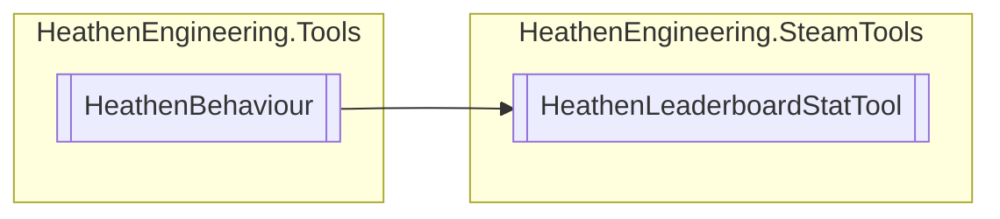

# HeathenLeaderboardStatTool `Public class`

## Diagram


## Members
### Methods
#### Public  methods
| Returns | Name |
| --- | --- |
| `void` | [`Submit`](#submit)() |

## Details
### Inheritance
 - `HeathenBehaviour`

### Constructors
#### HeathenLeaderboardStatTool
```csharp
public HeathenLeaderboardStatTool()
```

### Methods
#### Submit
```csharp
public void Submit()
```

*Generated with* [*ModularDoc*](https://github.com/hailstorm75/ModularDoc)
