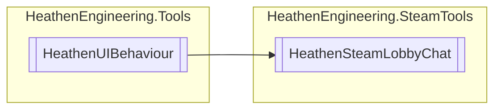

# HeathenSteamLobbyChat `Public class`

## Diagram


## Members
### Methods
#### Public  methods
| Returns | Name |
| --- | --- |
| `void` | [`RefreshTimeStampSettings`](#refreshtimestampsettings)() |
| `void` | [`SendChatMessage`](#sendchatmessage-12)(`...`) |

## Details
### Inheritance
 - `HeathenUIBehaviour`

### Constructors
#### HeathenSteamLobbyChat
```csharp
public HeathenSteamLobbyChat()
```

### Methods
#### RefreshTimeStampSettings
```csharp
public void RefreshTimeStampSettings()
```

#### SendChatMessage [1/2]
```csharp
public void SendChatMessage(string message)
```
##### Arguments
| Type | Name | Description |
| --- | --- | --- |
| `string` | message |   |

#### SendChatMessage [2/2]
```csharp
public void SendChatMessage()
```

*Generated with* [*ModularDoc*](https://github.com/hailstorm75/ModularDoc)
