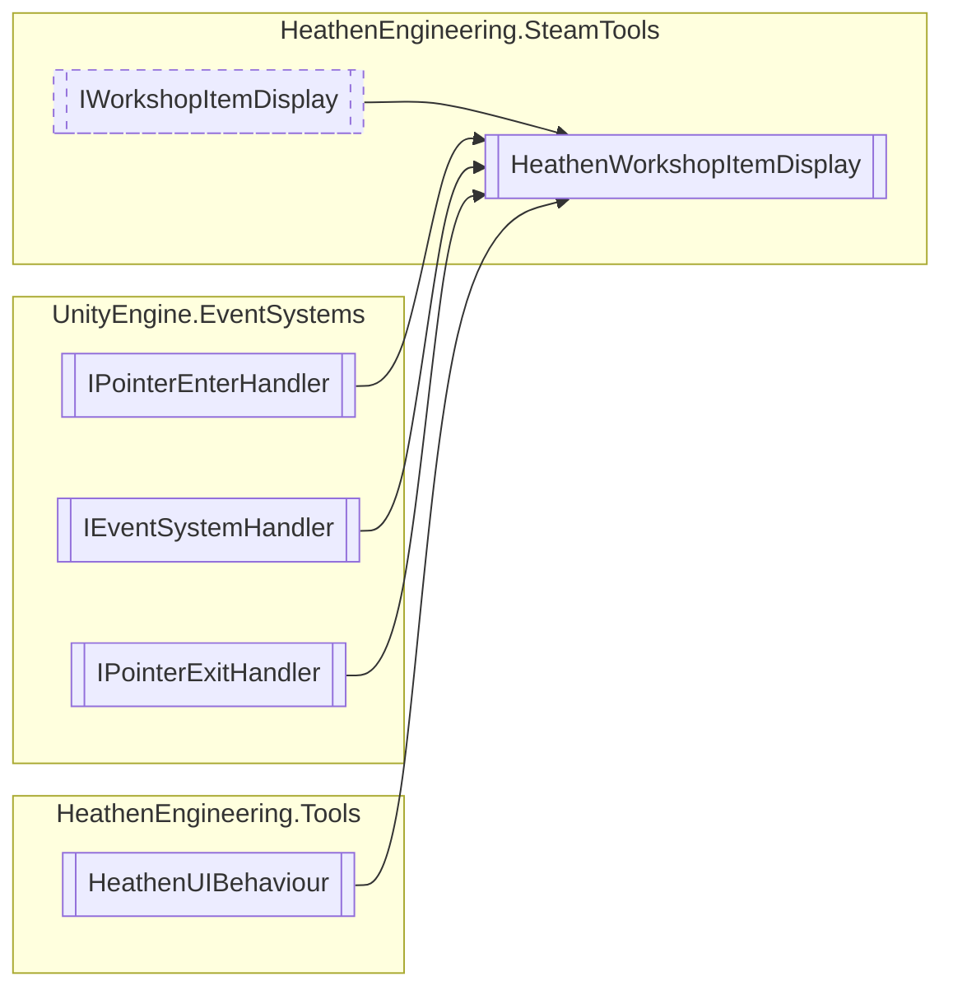

# HeathenWorkshopItemDisplay `Public class`

## Diagram


## Members
### Properties
#### Public  properties
| Type | Name | Methods |
| --- | --- | --- |
| [`HeathenWorkshopReadCommunityItem`](./heathenengineeringsteamtools-HeathenWorkshopReadCommunityItem) | [`Data`](#data) | `get, private set` |

### Methods
#### Public  methods
| Returns | Name |
| --- | --- |
| `void` | [`OnPointerEnter`](#onpointerenter)(`PointerEventData` eventData) |
| `void` | [`OnPointerExit`](#onpointerexit)(`PointerEventData` eventData) |
| `void` | [`RegisterData`](#registerdata)([`HeathenWorkshopReadCommunityItem`](./heathenengineeringsteamtools-HeathenWorkshopReadCommunityItem) data) |
| `void` | [`SetSubscribe`](#setsubscribe)(`bool` subscribed) |

## Details
### Inheritance
 - [
`IWorkshopItemDisplay`
](./heathenengineeringsteamtools-IWorkshopItemDisplay)
 - `IPointerEnterHandler`
 - `IEventSystemHandler`
 - `IPointerExitHandler`
 - `HeathenUIBehaviour`

### Constructors
#### HeathenWorkshopItemDisplay
```csharp
public HeathenWorkshopItemDisplay()
```

### Methods
#### RegisterData
```csharp
public virtual void RegisterData(HeathenWorkshopReadCommunityItem data)
```
##### Arguments
| Type | Name | Description |
| --- | --- | --- |
| [`HeathenWorkshopReadCommunityItem`](./heathenengineeringsteamtools-HeathenWorkshopReadCommunityItem) | data |   |

#### SetSubscribe
```csharp
public void SetSubscribe(bool subscribed)
```
##### Arguments
| Type | Name | Description |
| --- | --- | --- |
| `bool` | subscribed |   |

#### OnPointerEnter
```csharp
public virtual void OnPointerEnter(PointerEventData eventData)
```
##### Arguments
| Type | Name | Description |
| --- | --- | --- |
| `PointerEventData` | eventData |   |

#### OnPointerExit
```csharp
public virtual void OnPointerExit(PointerEventData eventData)
```
##### Arguments
| Type | Name | Description |
| --- | --- | --- |
| `PointerEventData` | eventData |   |

### Properties
#### Data
```csharp
public virtual HeathenWorkshopReadCommunityItem Data { get; private set; }
```

*Generated with* [*ModularDoc*](https://github.com/hailstorm75/ModularDoc)
