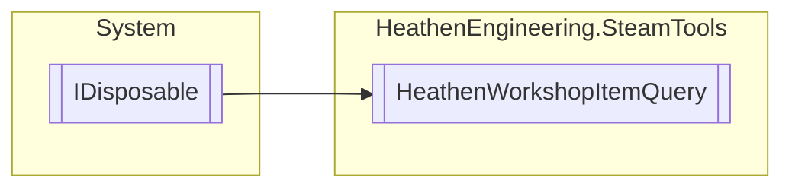

# HeathenWorkshopItemQuery `Public class`

## Diagram


## Members
### Properties
#### Public  properties
| Type | Name | Methods |
| --- | --- | --- |
| `uint` | [`Page`](#page) | `get, private set` |

### Methods
#### Public Static methods
| Returns | Name |
| --- | --- |
| [`HeathenWorkshopItemQuery`](heathenengineeringsteamtools-HeathenWorkshopItemQuery) | [`Create`](#create-13)(`...`) |

#### Public  methods
| Returns | Name |
| --- | --- |
| `void` | [`Dispose`](#dispose)() |
| `bool` | [`Execute`](#execute)(`UnityAction`&lt;[`HeathenWorkshopItemQuery`](heathenengineeringsteamtools-HeathenWorkshopItemQuery)&gt; callback) |
| `void` | [`ReleaseHandle`](#releasehandle)() |
| `bool` | [`SetNextPage`](#setnextpage)() |
| `bool` | [`SetPage`](#setpage)(`uint` page) |
| `bool` | [`SetPreviousPage`](#setpreviouspage)() |

## Details
### Inheritance
 - `IDisposable`

### Constructors
#### HeathenWorkshopItemQuery
```csharp
public HeathenWorkshopItemQuery()
```

### Methods
#### Create [1/3]
```csharp
public static HeathenWorkshopItemQuery Create(EUGCQuery queryType, EUGCMatchingUGCType matchingType, AppId_t creatorApp, AppId_t consumerApp)
```
##### Arguments
| Type | Name | Description |
| --- | --- | --- |
| `EUGCQuery` | queryType |   |
| `EUGCMatchingUGCType` | matchingType |   |
| `AppId_t` | creatorApp |   |
| `AppId_t` | consumerApp |   |

#### Create [2/3]
```csharp
public static HeathenWorkshopItemQuery Create(IEnumerable<PublishedFileId_t> fileIds)
```
##### Arguments
| Type | Name | Description |
| --- | --- | --- |
| `IEnumerable`&lt;`PublishedFileId_t`&gt; | fileIds |   |

#### Create [3/3]
```csharp
public static HeathenWorkshopItemQuery Create(AccountID_t account, EUserUGCList listType, EUGCMatchingUGCType matchingType, EUserUGCListSortOrder sortOrder, AppId_t creatorApp, AppId_t consumerApp)
```
##### Arguments
| Type | Name | Description |
| --- | --- | --- |
| `AccountID_t` | account |   |
| `EUserUGCList` | listType |   |
| `EUGCMatchingUGCType` | matchingType |   |
| `EUserUGCListSortOrder` | sortOrder |   |
| `AppId_t` | creatorApp |   |
| `AppId_t` | consumerApp |   |

#### SetNextPage
```csharp
public bool SetNextPage()
```

#### SetPreviousPage
```csharp
public bool SetPreviousPage()
```

#### SetPage
```csharp
public bool SetPage(uint page)
```
##### Arguments
| Type | Name | Description |
| --- | --- | --- |
| `uint` | page |   |

#### Execute
```csharp
public bool Execute(UnityAction<HeathenWorkshopItemQuery> callback)
```
##### Arguments
| Type | Name | Description |
| --- | --- | --- |
| `UnityAction`&lt;[`HeathenWorkshopItemQuery`](heathenengineeringsteamtools-HeathenWorkshopItemQuery)&gt; | callback |   |

#### ReleaseHandle
```csharp
public void ReleaseHandle()
```

#### Dispose
```csharp
public virtual void Dispose()
```

### Properties
#### Page
```csharp
public uint Page { get; private set; }
```

*Generated with* [*ModularDoc*](https://github.com/hailstorm75/ModularDoc)
