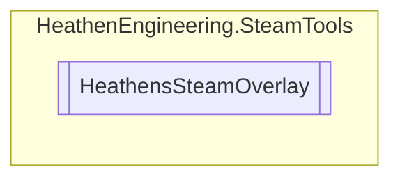

# HeathensSteamOverlay `Public class`

## Diagram


## Members
### Properties
#### Public  properties
| Type | Name | Methods |
| --- | --- | --- |
| `bool` | [`IsEnabled`](#isenabled) | `get` |
| `bool` | [`IsOpen`](#isopen) | `get` |

### Methods
#### Public  methods
| Returns | Name |
| --- | --- |
| `void` | [`HandleOnOverlayOpen`](#handleonoverlayopen)(`GameOverlayActivated_t` data) |
| `void` | [`Invite`](#invite)(`CSteamID` lobbyId) |
| `void` | [`Open`](#open)(`string` dialog) |
| `void` | [`OpenAchievements`](#openachievements-12)(`...`) |
| `void` | [`OpenChat`](#openchat)(`CSteamID` user) |
| `void` | [`OpenCommunity`](#opencommunity)() |
| `void` | [`OpenFriendAdd`](#openfriendadd)(`CSteamID` user) |
| `void` | [`OpenFriendRemove`](#openfriendremove)(`CSteamID` user) |
| `void` | [`OpenFriends`](#openfriends)() |
| `void` | [`OpenOfficialGameGroup`](#openofficialgamegroup)() |
| `void` | [`OpenPlayers`](#openplayers)() |
| `void` | [`OpenProfile`](#openprofile)(`CSteamID` user) |
| `void` | [`OpenRequestAccept`](#openrequestaccept)(`CSteamID` user) |
| `void` | [`OpenRequestIgnore`](#openrequestignore)(`CSteamID` user) |
| `void` | [`OpenSettings`](#opensettings)() |
| `void` | [`OpenStats`](#openstats-12)(`...`) |
| `void` | [`OpenStore`](#openstore-14)(`...`) |
| `void` | [`OpenTrade`](#opentrade)(`CSteamID` user) |
| `void` | [`OpenWebPage`](#openwebpage)(`string` URL) |

## Details
### Constructors
#### HeathensSteamOverlay
```csharp
public HeathensSteamOverlay()
```

### Methods
#### HandleOnOverlayOpen
```csharp
public void HandleOnOverlayOpen(GameOverlayActivated_t data)
```
##### Arguments
| Type | Name | Description |
| --- | --- | --- |
| `GameOverlayActivated_t` | data |   |

#### Invite
```csharp
public void Invite(CSteamID lobbyId)
```
##### Arguments
| Type | Name | Description |
| --- | --- | --- |
| `CSteamID` | lobbyId |   |

#### OpenStore [1/4]
```csharp
public void OpenStore()
```

#### OpenStore [2/4]
```csharp
public void OpenStore(uint appId)
```
##### Arguments
| Type | Name | Description |
| --- | --- | --- |
| `uint` | appId |   |

#### OpenStore [3/4]
```csharp
public void OpenStore(uint appId, EOverlayToStoreFlag flag)
```
##### Arguments
| Type | Name | Description |
| --- | --- | --- |
| `uint` | appId |   |
| `EOverlayToStoreFlag` | flag |   |

#### OpenStore [4/4]
```csharp
public void OpenStore(AppId_t appId, EOverlayToStoreFlag flag)
```
##### Arguments
| Type | Name | Description |
| --- | --- | --- |
| `AppId_t` | appId |   |
| `EOverlayToStoreFlag` | flag |   |

#### Open
```csharp
public void Open(string dialog)
```
##### Arguments
| Type | Name | Description |
| --- | --- | --- |
| `string` | dialog |   |

#### OpenWebPage
```csharp
public void OpenWebPage(string URL)
```
##### Arguments
| Type | Name | Description |
| --- | --- | --- |
| `string` | URL |   |

#### OpenFriends
```csharp
public void OpenFriends()
```

#### OpenCommunity
```csharp
public void OpenCommunity()
```

#### OpenPlayers
```csharp
public void OpenPlayers()
```

#### OpenSettings
```csharp
public void OpenSettings()
```

#### OpenOfficialGameGroup
```csharp
public void OpenOfficialGameGroup()
```

#### OpenStats [1/2]
```csharp
public void OpenStats()
```

#### OpenAchievements [1/2]
```csharp
public void OpenAchievements()
```

#### OpenChat
```csharp
public void OpenChat(CSteamID user)
```
##### Arguments
| Type | Name | Description |
| --- | --- | --- |
| `CSteamID` | user |   |

#### OpenProfile
```csharp
public void OpenProfile(CSteamID user)
```
##### Arguments
| Type | Name | Description |
| --- | --- | --- |
| `CSteamID` | user |   |

#### OpenTrade
```csharp
public void OpenTrade(CSteamID user)
```
##### Arguments
| Type | Name | Description |
| --- | --- | --- |
| `CSteamID` | user |   |

#### OpenStats [2/2]
```csharp
public void OpenStats(CSteamID user)
```
##### Arguments
| Type | Name | Description |
| --- | --- | --- |
| `CSteamID` | user |   |

#### OpenAchievements [2/2]
```csharp
public void OpenAchievements(CSteamID user)
```
##### Arguments
| Type | Name | Description |
| --- | --- | --- |
| `CSteamID` | user |   |

#### OpenFriendAdd
```csharp
public void OpenFriendAdd(CSteamID user)
```
##### Arguments
| Type | Name | Description |
| --- | --- | --- |
| `CSteamID` | user |   |

#### OpenFriendRemove
```csharp
public void OpenFriendRemove(CSteamID user)
```
##### Arguments
| Type | Name | Description |
| --- | --- | --- |
| `CSteamID` | user |   |

#### OpenRequestAccept
```csharp
public void OpenRequestAccept(CSteamID user)
```
##### Arguments
| Type | Name | Description |
| --- | --- | --- |
| `CSteamID` | user |   |

#### OpenRequestIgnore
```csharp
public void OpenRequestIgnore(CSteamID user)
```
##### Arguments
| Type | Name | Description |
| --- | --- | --- |
| `CSteamID` | user |   |

### Properties
#### IsEnabled
```csharp
public bool IsEnabled { get; }
```

#### IsOpen
```csharp
public bool IsOpen { get; }
```

*Generated with* [*ModularDoc*](https://github.com/hailstorm75/ModularDoc)
