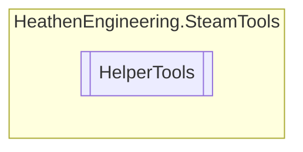

# HelperTools `Public class`

## Diagram


## Members
### Methods
#### Public Static methods
| Returns | Name |
| --- | --- |
| `DateTime` | [`ConvertNixDate`](#convertnixdate)(`uint` nixTime) |
| `byte``[]` | [`FlipImageBufferVertical`](#flipimagebuffervertical)(`int` width, `int` height, `byte``[]` buffer) |
| `bool` | [`LoadImageFromDisk`](#loadimagefromdisk)(`string` path, out `Texture2D` texture) |
| `bool` | [`WorkshopItemStateHasAllFlags`](#workshopitemstatehasallflags)(`EItemState` value, `EItemState``[]` checkflags) |
| `bool` | [`WorkshopItemStateHasFlag`](#workshopitemstatehasflag)(`EItemState` value, `EItemState` checkflag) |

## Details
### Methods
#### FlipImageBufferVertical
```csharp
public static byte FlipImageBufferVertical(int width, int height, byte[] buffer)
```
##### Arguments
| Type | Name | Description |
| --- | --- | --- |
| `int` | width |   |
| `int` | height |   |
| `byte``[]` | buffer |   |

#### LoadImageFromDisk
```csharp
public static bool LoadImageFromDisk(string path, out Texture2D texture)
```
##### Arguments
| Type | Name | Description |
| --- | --- | --- |
| `string` | path |   |
| `out` `Texture2D` | texture |   |

#### ConvertNixDate
```csharp
public static DateTime ConvertNixDate(uint nixTime)
```
##### Arguments
| Type | Name | Description |
| --- | --- | --- |
| `uint` | nixTime |   |

#### WorkshopItemStateHasFlag
```csharp
public static bool WorkshopItemStateHasFlag(EItemState value, EItemState checkflag)
```
##### Arguments
| Type | Name | Description |
| --- | --- | --- |
| `EItemState` | value |   |
| `EItemState` | checkflag |   |

#### WorkshopItemStateHasAllFlags
```csharp
public static bool WorkshopItemStateHasAllFlags(EItemState value, EItemState[] checkflags)
```
##### Arguments
| Type | Name | Description |
| --- | --- | --- |
| `EItemState` | value |   |
| `EItemState``[]` | checkflags |   |

*Generated with* [*ModularDoc*](https://github.com/hailstorm75/ModularDoc)
