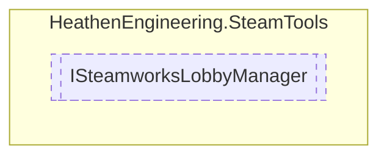

# ISteamworksLobbyManager `Public interface`

## Diagram


## Members
### Properties
#### Public  properties
| Type | Name | Methods |
| --- | --- | --- |
| `bool` | [`IsQuickSearching`](#isquicksearching) | `get` |
| `bool` | [`IsSearching`](#issearching) | `get` |

### Methods
#### Public  methods
| Returns | Name |
| --- | --- |
| `void` | [`CancelQuickMatch`](#cancelquickmatch)() |
| `void` | [`CancelStandardSearch`](#cancelstandardsearch)() |
| `void` | [`CreateLobby`](#createlobby)([`LobbyHunterFilter`](./heathenengineeringsteamtools-LobbyHunterFilter) LobbyFilter, `string` LobbyName, `ELobbyType` lobbyType) |
| `void` | [`FindMatch`](#findmatch)([`LobbyHunterFilter`](./heathenengineeringsteamtools-LobbyHunterFilter) LobbyFilter) |
| `void` | [`JoinLobby`](#joinlobby)(`CSteamID` lobbyId) |
| `void` | [`LeaveLobby`](#leavelobby)() |
| `bool` | [`QuickMatch`](#quickmatch)([`LobbyHunterFilter`](./heathenengineeringsteamtools-LobbyHunterFilter) LobbyFilter, `string` onCreateName, `bool` autoCreate) |
| `void` | [`SendChatMessage`](#sendchatmessage)(`string` message) |
| `void` | [`SetLobbyGameServer`](#setlobbygameserver)() |
| `void` | [`SetLobbyMetadata`](#setlobbymetadata)(`string` key, `string` value) |
| `void` | [`SetMemberMetadata`](#setmembermetadata)(`string` key, `string` value) |

## Details
### Methods
#### CreateLobby
```csharp
public void CreateLobby(LobbyHunterFilter LobbyFilter, string LobbyName, ELobbyType lobbyType)
```
##### Arguments
| Type | Name | Description |
| --- | --- | --- |
| [`LobbyHunterFilter`](./heathenengineeringsteamtools-LobbyHunterFilter) | LobbyFilter |   |
| `string` | LobbyName |   |
| `ELobbyType` | lobbyType |   |

#### JoinLobby
```csharp
public void JoinLobby(CSteamID lobbyId)
```
##### Arguments
| Type | Name | Description |
| --- | --- | --- |
| `CSteamID` | lobbyId |   |

#### LeaveLobby
```csharp
public void LeaveLobby()
```

#### FindMatch
```csharp
public void FindMatch(LobbyHunterFilter LobbyFilter)
```
##### Arguments
| Type | Name | Description |
| --- | --- | --- |
| [`LobbyHunterFilter`](./heathenengineeringsteamtools-LobbyHunterFilter) | LobbyFilter |   |

#### QuickMatch
```csharp
public bool QuickMatch(LobbyHunterFilter LobbyFilter, string onCreateName, bool autoCreate)
```
##### Arguments
| Type | Name | Description |
| --- | --- | --- |
| [`LobbyHunterFilter`](./heathenengineeringsteamtools-LobbyHunterFilter) | LobbyFilter |   |
| `string` | onCreateName |   |
| `bool` | autoCreate |   |

#### CancelQuickMatch
```csharp
public void CancelQuickMatch()
```

#### CancelStandardSearch
```csharp
public void CancelStandardSearch()
```

#### SendChatMessage
```csharp
public void SendChatMessage(string message)
```
##### Arguments
| Type | Name | Description |
| --- | --- | --- |
| `string` | message |   |

#### SetLobbyMetadata
```csharp
public void SetLobbyMetadata(string key, string value)
```
##### Arguments
| Type | Name | Description |
| --- | --- | --- |
| `string` | key |   |
| `string` | value |   |

#### SetMemberMetadata
```csharp
public void SetMemberMetadata(string key, string value)
```
##### Arguments
| Type | Name | Description |
| --- | --- | --- |
| `string` | key |   |
| `string` | value |   |

#### SetLobbyGameServer
```csharp
public void SetLobbyGameServer()
```

### Properties
#### IsSearching
```csharp
public bool IsSearching { get; }
```

#### IsQuickSearching
```csharp
public bool IsQuickSearching { get; }
```

*Generated with* [*ModularDoc*](https://github.com/hailstorm75/ModularDoc)
