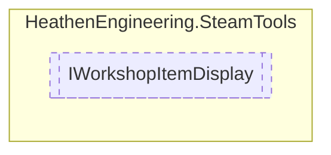

# IWorkshopItemDisplay `Public interface`

## Diagram


## Members
### Properties
#### Public  properties
| Type | Name | Methods |
| --- | --- | --- |
| [`HeathenWorkshopReadCommunityItem`](./heathenengineeringsteamtools-HeathenWorkshopReadCommunityItem) | [`Data`](#data) | `get` |

### Methods
#### Public  methods
| Returns | Name |
| --- | --- |
| `void` | [`RegisterData`](#registerdata)([`HeathenWorkshopReadCommunityItem`](./heathenengineeringsteamtools-HeathenWorkshopReadCommunityItem) data) |

## Details
### Methods
#### RegisterData
```csharp
public void RegisterData(HeathenWorkshopReadCommunityItem data)
```
##### Arguments
| Type | Name | Description |
| --- | --- | --- |
| [`HeathenWorkshopReadCommunityItem`](./heathenengineeringsteamtools-HeathenWorkshopReadCommunityItem) | data |   |

### Properties
#### Data
```csharp
public HeathenWorkshopReadCommunityItem Data { get; }
```

*Generated with* [*ModularDoc*](https://github.com/hailstorm75/ModularDoc)
