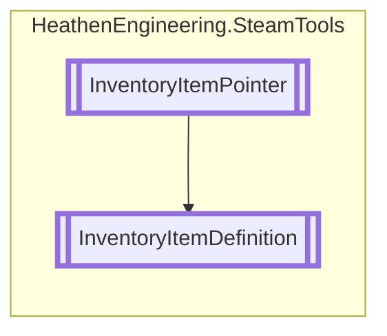

# InventoryItemDefinition `Public class`

## Diagram


## Members
### Properties
#### Public  properties
| Type | Name | Methods |
| --- | --- | --- |
| `int` | [`Count`](#count) | `get` |
| [`InventoryItemType`](./heathenengineeringsteamtools-InventoryItemType) | [`ItemType`](#itemtype) | `get` |

### Methods
#### Public  methods
| Returns | Name |
| --- | --- |
| `void` | [`Consolidate`](#consolidate)() |
| `void` | [`Consume`](#consume)(`int` count) |
| `List`&lt;[`ExchangeItemCount`](./heathenengineeringsteamtools-ExchangeItemCount)&gt; | [`FetchItemCount`](#fetchitemcount)(`uint` count, `bool` decriment) |
| `bool` | [`SplitInstance`](#splitinstance)(`SteamItemDetails_t` source, `uint` quantity) |
| `bool` | [`StackInstance`](#stackinstance)(`SteamItemDetails_t` source, `SteamItemInstanceID_t` destination) |
| `bool` | [`TransferQuantity`](#transferquantity-12)(`...`) |

## Details
### Inheritance
 - [
`InventoryItemPointer`
](./heathenengineeringsteamtools-InventoryItemPointer)

### Constructors
#### InventoryItemDefinition
```csharp
protected InventoryItemDefinition()
```

### Methods
#### Consume
```csharp
public void Consume(int count)
```
##### Arguments
| Type | Name | Description |
| --- | --- | --- |
| `int` | count |   |

#### FetchItemCount
```csharp
public List<ExchangeItemCount> FetchItemCount(uint count, bool decriment)
```
##### Arguments
| Type | Name | Description |
| --- | --- | --- |
| `uint` | count |   |
| `bool` | decriment |   |

#### TransferQuantity [1/2]
```csharp
public bool TransferQuantity(int source, uint quantity, int destination)
```
##### Arguments
| Type | Name | Description |
| --- | --- | --- |
| `int` | source |   |
| `uint` | quantity |   |
| `int` | destination |   |

#### TransferQuantity [2/2]
```csharp
public bool TransferQuantity(SteamItemDetails_t source, uint quantity, SteamItemInstanceID_t destination)
```
##### Arguments
| Type | Name | Description |
| --- | --- | --- |
| `SteamItemDetails_t` | source |   |
| `uint` | quantity |   |
| `SteamItemInstanceID_t` | destination |   |

#### SplitInstance
```csharp
public bool SplitInstance(SteamItemDetails_t source, uint quantity)
```
##### Arguments
| Type | Name | Description |
| --- | --- | --- |
| `SteamItemDetails_t` | source |   |
| `uint` | quantity |   |

#### StackInstance
```csharp
public bool StackInstance(SteamItemDetails_t source, SteamItemInstanceID_t destination)
```
##### Arguments
| Type | Name | Description |
| --- | --- | --- |
| `SteamItemDetails_t` | source |   |
| `SteamItemInstanceID_t` | destination |   |

#### Consolidate
```csharp
public void Consolidate()
```

### Properties
#### ItemType
```csharp
public override InventoryItemType ItemType { get; }
```

#### Count
```csharp
public int Count { get; }
```

*Generated with* [*ModularDoc*](https://github.com/hailstorm75/ModularDoc)
