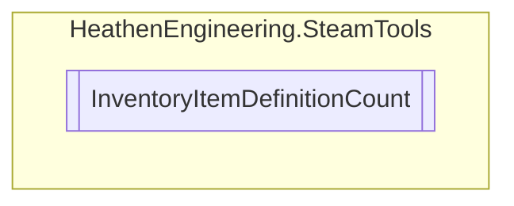

# InventoryItemDefinitionCount `Public class`

## Diagram


## Members
### Methods
#### Public  methods
| Returns | Name |
| --- | --- |
| `List`&lt;[`ExchangeItemCount`](./heathenengineeringsteamtools-ExchangeItemCount)&gt; | [`FetchFromItem`](#fetchfromitem)(`bool` decriment) |

## Details
### Constructors
#### InventoryItemDefinitionCount
```csharp
public InventoryItemDefinitionCount()
```

### Methods
#### FetchFromItem
```csharp
public List<ExchangeItemCount> FetchFromItem(bool decriment)
```
##### Arguments
| Type | Name | Description |
| --- | --- | --- |
| `bool` | decriment |   |

*Generated with* [*ModularDoc*](https://github.com/hailstorm75/ModularDoc)
