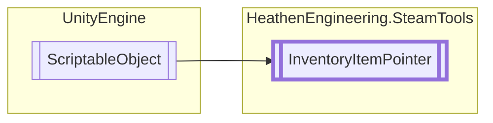

# InventoryItemPointer `Public class`

## Diagram


## Members
### Properties
#### Public  properties
| Type | Name | Methods |
| --- | --- | --- |
| [`CraftingRecipe`](./heathenengineeringsteamtools-CraftingRecipe) | [`Item`](#item) | `get` |
| [`InventoryItemType`](./heathenengineeringsteamtools-InventoryItemType) | [`ItemType`](#itemtype) | `get` |

### Methods
#### Public  methods
| Returns | Name |
| --- | --- |
| `void` | [`Craft`](#craft-12)(`...`) |
| `void` | [`GrantPromoItem`](#grantpromoitem)() |
| [`ItemExchangeRecipe`](./heathenengineeringsteamtools-ItemExchangeRecipe) | [`PrepareItemExchange`](#prepareitemexchange)([`CraftingRecipe`](./heathenengineeringsteamtools-CraftingRecipe) recipe, out `Dictionary`&lt;[`InventoryItemDefinition`](./heathenengineeringsteamtools-InventoryItemDefinition), `List`&lt;`SteamItemDetails_t`&gt;&gt; Edits) |

## Details
### Inheritance
 - `ScriptableObject`

### Constructors
#### InventoryItemPointer
```csharp
protected InventoryItemPointer()
```

### Methods
#### PrepareItemExchange
```csharp
public ItemExchangeRecipe PrepareItemExchange(CraftingRecipe recipe, out Dictionary<InventoryItemDefinition, List<SteamItemDetails_t>> Edits)
```
##### Arguments
| Type | Name | Description |
| --- | --- | --- |
| [`CraftingRecipe`](./heathenengineeringsteamtools-CraftingRecipe) | recipe |   |
| `out` `Dictionary`&lt;[`InventoryItemDefinition`](./heathenengineeringsteamtools-InventoryItemDefinition), `List`&lt;`SteamItemDetails_t`&gt;&gt; | Edits |   |

#### Craft [1/2]
```csharp
public void Craft(CraftingRecipe recipe)
```
##### Arguments
| Type | Name | Description |
| --- | --- | --- |
| [`CraftingRecipe`](./heathenengineeringsteamtools-CraftingRecipe) | recipe |   |

#### Craft [2/2]
```csharp
public void Craft(int recipeIndex)
```
##### Arguments
| Type | Name | Description |
| --- | --- | --- |
| `int` | recipeIndex |   |

#### GrantPromoItem
```csharp
public void GrantPromoItem()
```

### Properties
#### ItemType
```csharp
public abstract InventoryItemType ItemType { get; }
```

#### Item
```csharp
public CraftingRecipe Item { get; }
```

*Generated with* [*ModularDoc*](https://github.com/hailstorm75/ModularDoc)
