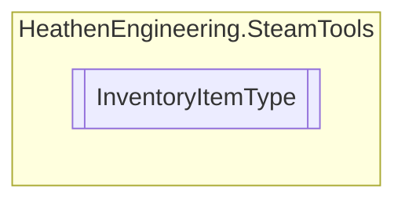

# InventoryItemType `Public enum`

## Diagram

```mermaid
  flowchart LR
  classDef interfaceStyle stroke-dasharray: 5 5;
  classDef abstractStyle stroke-width:4px
  subgraph HeathenEngineering.SteamTools
  HeathenEngineering.SteamTools.InventoryItemType[[InventoryItemType]]
  end
```

## Details
### Fields
#### ItemDefinition

#### ItemGenerator

*Generated with* [*ModularDoc*](https://github.com/hailstorm75/ModularDoc)
