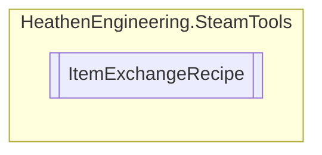

# ItemExchangeRecipe `Public class`

## Diagram


## Members
### Methods
#### Public  methods
| Returns | Name |
| --- | --- |
| `SteamItemInstanceID_t``[]` | [`GetInstanceArray`](#getinstancearray)() |
| `uint``[]` | [`GetQuantityArray`](#getquantityarray)() |

## Details
### Constructors
#### ItemExchangeRecipe [1/2]
```csharp
public ItemExchangeRecipe()
```

#### ItemExchangeRecipe [2/2]
```csharp
public ItemExchangeRecipe(SteamItemDef_t toGenerate, IEnumerable<ExchangeItemCount> toBeConsumed)
```
##### Arguments
| Type | Name | Description |
| --- | --- | --- |
| `SteamItemDef_t` | toGenerate |   |
| `IEnumerable`&lt;[`ExchangeItemCount`](./heathenengineeringsteamtools-ExchangeItemCount)&gt; | toBeConsumed |   |

### Methods
#### GetInstanceArray
```csharp
public SteamItemInstanceID_t GetInstanceArray()
```

#### GetQuantityArray
```csharp
public uint GetQuantityArray()
```

*Generated with* [*ModularDoc*](https://github.com/hailstorm75/ModularDoc)
