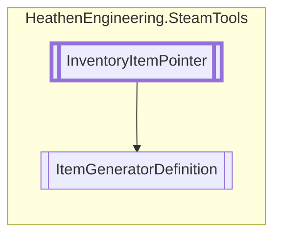

# ItemGeneratorDefinition `Public class`

## Diagram


## Members
### Properties
#### Public  properties
| Type | Name | Methods |
| --- | --- | --- |
| [`InventoryItemType`](./heathenengineeringsteamtools-InventoryItemType) | [`ItemType`](#itemtype) | `get` |

### Methods
#### Public  methods
| Returns | Name |
| --- | --- |
| `void` | [`TriggerDrop`](#triggerdrop-12)(`...`) |

## Details
### Inheritance
 - [
`InventoryItemPointer`
](./heathenengineeringsteamtools-InventoryItemPointer)

### Constructors
#### ItemGeneratorDefinition
```csharp
public ItemGeneratorDefinition()
```

### Methods
#### TriggerDrop [1/2]
```csharp
public void TriggerDrop(Action<bool, SteamItemDetails_t[]> callback)
```
##### Arguments
| Type | Name | Description |
| --- | --- | --- |
| `Action`&lt;`bool`, `SteamItemDetails_t``[]`&gt; | callback |   |

#### TriggerDrop [2/2]
```csharp
public void TriggerDrop()
```

### Properties
#### ItemType
```csharp
public override InventoryItemType ItemType { get; }
```

*Generated with* [*ModularDoc*](https://github.com/hailstorm75/ModularDoc)
