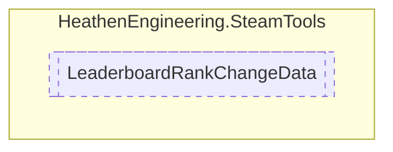

# LeaderboardRankChangeData `Public struct`

## Diagram


## Members
### Properties
#### Public  properties
| Type | Name | Methods |
| --- | --- | --- |
| `int` | [`rankDelta`](#rankdelta) | `get` |
| `int` | [`scoreDeta`](#scoredeta) | `get` |

## Details
### Properties
#### rankDelta
```csharp
public int rankDelta { get; }
```

#### scoreDeta
```csharp
public int scoreDeta { get; }
```

*Generated with* [*ModularDoc*](https://github.com/hailstorm75/ModularDoc)
