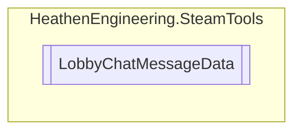

# LobbyChatMessageData `Public class`

## Diagram


## Details
### Constructors
#### LobbyChatMessageData
```csharp
public LobbyChatMessageData()
```

*Generated with* [*ModularDoc*](https://github.com/hailstorm75/ModularDoc)
