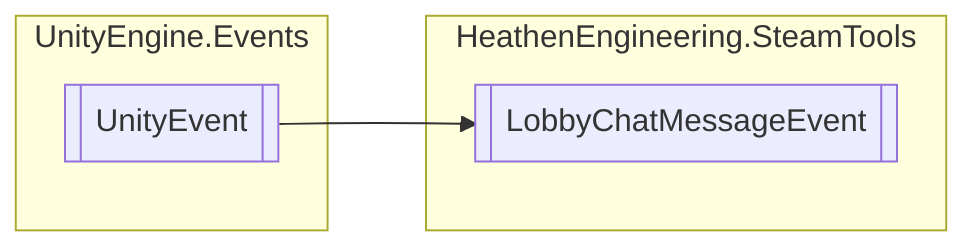

# LobbyChatMessageEvent `Public class`

## Diagram


## Details
### Inheritance
 - `UnityEvent`&lt;[`LobbyChatMessageData`](./heathenengineeringsteamtools-LobbyChatMessageData)&gt;

### Constructors
#### LobbyChatMessageEvent
```csharp
public LobbyChatMessageEvent()
```

*Generated with* [*ModularDoc*](https://github.com/hailstorm75/ModularDoc)
