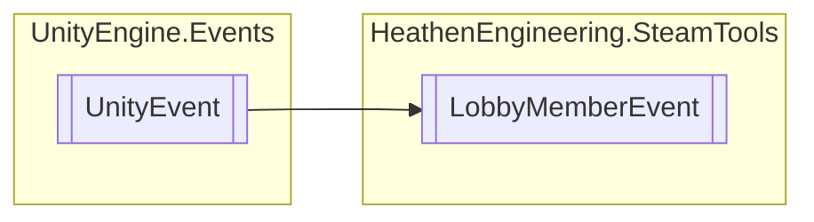

# LobbyMemberEvent `Public class`

## Diagram


## Details
### Inheritance
 - `UnityEvent`&lt;[`LobbyMember`](./heathenengineeringsteamtools-LobbyMember)&gt;

### Constructors
#### LobbyMemberEvent
```csharp
public LobbyMemberEvent()
```

*Generated with* [*ModularDoc*](https://github.com/hailstorm75/ModularDoc)
