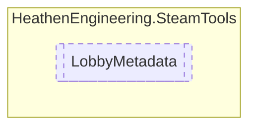

# LobbyMetadata `Public struct`

## Diagram


## Members
### Properties
#### Public  properties
| Type | Name | Methods |
| --- | --- | --- |
| `string` | [`Item`](#item) | `get, set` |

## Details
### Properties
#### Item
```csharp
public string Item { get; set; }
```

*Generated with* [*ModularDoc*](https://github.com/hailstorm75/ModularDoc)
