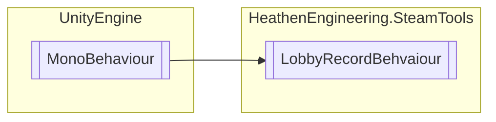

# LobbyRecordBehvaiour `Public class`

## Diagram


## Members
### Methods
#### Public  methods
| Returns | Name |
| --- | --- |
| `void` | [`SetLobby`](#setlobby)([`LobbyHunterLobbyRecord`](./heathenengineeringsteamtools-LobbyHunterLobbyRecord) record, [`HeathenSteamLobbySettings`](./heathenengineeringsteamtools-HeathenSteamLobbySettings) lobbySettings) |

## Details
### Inheritance
 - `MonoBehaviour`

### Constructors
#### LobbyRecordBehvaiour
```csharp
public LobbyRecordBehvaiour()
```

### Methods
#### SetLobby
```csharp
public virtual void SetLobby(LobbyHunterLobbyRecord record, HeathenSteamLobbySettings lobbySettings)
```
##### Arguments
| Type | Name | Description |
| --- | --- | --- |
| [`LobbyHunterLobbyRecord`](./heathenengineeringsteamtools-LobbyHunterLobbyRecord) | record |   |
| [`HeathenSteamLobbySettings`](./heathenengineeringsteamtools-HeathenSteamLobbySettings) | lobbySettings |   |

*Generated with* [*ModularDoc*](https://github.com/hailstorm75/ModularDoc)
