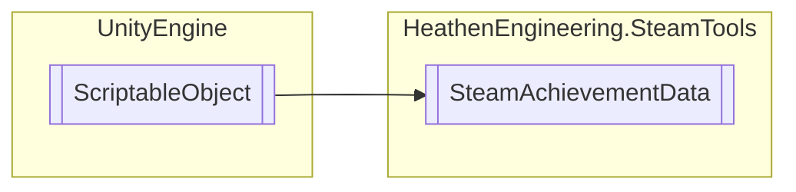

# SteamAchievementData `Public class`

## Diagram


## Members
### Methods
#### Public  methods
| Returns | Name |
| --- | --- |
| `void` | [`Unlock`](#unlock)() |

## Details
### Inheritance
 - `ScriptableObject`

### Constructors
#### SteamAchievementData
```csharp
public SteamAchievementData()
```

### Methods
#### Unlock
```csharp
public void Unlock()
```

*Generated with* [*ModularDoc*](https://github.com/hailstorm75/ModularDoc)
