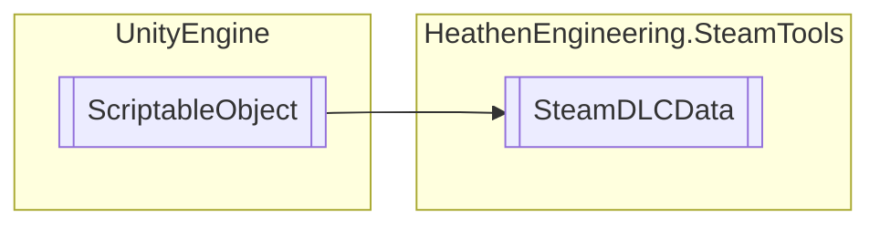

# SteamDLCData `Public class`

## Diagram


## Members
### Methods
#### Public  methods
| Returns | Name |
| --- | --- |
| `float` | [`GetDownloadProgress`](#getdownloadprogress)() |
| `DateTime` | [`GetEarliestPurchaseTime`](#getearliestpurchasetime)() |
| `string` | [`GetInstallDirectory`](#getinstalldirectory)() |
| `bool` | [`GetIsInstalled`](#getisinstalled)() |
| `bool` | [`GetIsSubscribed`](#getissubscribed)() |
| `void` | [`InstallDLC`](#installdlc)() |
| `void` | [`OpenStore`](#openstore)(`EOverlayToStoreFlag` flag) |
| `void` | [`UninstallDLC`](#uninstalldlc)() |
| `void` | [`UpdateStatus`](#updatestatus)() |

## Details
### Inheritance
 - `ScriptableObject`

### Constructors
#### SteamDLCData
```csharp
public SteamDLCData()
```

### Methods
#### UpdateStatus
```csharp
public void UpdateStatus()
```

#### GetIsSubscribed
```csharp
public bool GetIsSubscribed()
```

#### GetIsInstalled
```csharp
public bool GetIsInstalled()
```

#### GetInstallDirectory
```csharp
public string GetInstallDirectory()
```

#### GetDownloadProgress
```csharp
public float GetDownloadProgress()
```

#### GetEarliestPurchaseTime
```csharp
public DateTime GetEarliestPurchaseTime()
```

#### InstallDLC
```csharp
public void InstallDLC()
```

#### UninstallDLC
```csharp
public void UninstallDLC()
```

#### OpenStore
```csharp
public void OpenStore(EOverlayToStoreFlag flag)
```
##### Arguments
| Type | Name | Description |
| --- | --- | --- |
| `EOverlayToStoreFlag` | flag |   |

*Generated with* [*ModularDoc*](https://github.com/hailstorm75/ModularDoc)
