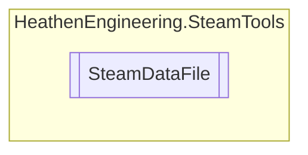

# SteamDataFile `Public class`

## Diagram


## Members
### Methods
#### Public  methods
| Returns | Name |
| --- | --- |
| `string` | [`EncodeASCII`](#encodeascii)() |
| `string` | [`EncodeDefault`](#encodedefault)() |
| `string` | [`EncodeUTF32`](#encodeutf32)() |
| `string` | [`EncodeUTF8`](#encodeutf8)() |
| `string` | [`EncodeUnicode`](#encodeunicode)() |
| `void` | [`ReadFromLibrary`](#readfromlibrary)([`SteamDataLibrary`](./heathenengineeringsteamtools-SteamDataLibrary) dataLibrary) |
| `void` | [`WriteToLibrary`](#writetolibrary)([`SteamDataLibrary`](./heathenengineeringsteamtools-SteamDataLibrary) dataLibrary) |

## Details
### Constructors
#### SteamDataFile
```csharp
public SteamDataFile()
```

### Methods
#### ReadFromLibrary
```csharp
public void ReadFromLibrary(SteamDataLibrary dataLibrary)
```
##### Arguments
| Type | Name | Description |
| --- | --- | --- |
| [`SteamDataLibrary`](./heathenengineeringsteamtools-SteamDataLibrary) | dataLibrary |   |

#### WriteToLibrary
```csharp
public void WriteToLibrary(SteamDataLibrary dataLibrary)
```
##### Arguments
| Type | Name | Description |
| --- | --- | --- |
| [`SteamDataLibrary`](./heathenengineeringsteamtools-SteamDataLibrary) | dataLibrary |   |

#### EncodeUTF8
```csharp
public string EncodeUTF8()
```

#### EncodeUTF32
```csharp
public string EncodeUTF32()
```

#### EncodeUnicode
```csharp
public string EncodeUnicode()
```

#### EncodeDefault
```csharp
public string EncodeDefault()
```

#### EncodeASCII
```csharp
public string EncodeASCII()
```

*Generated with* [*ModularDoc*](https://github.com/hailstorm75/ModularDoc)
