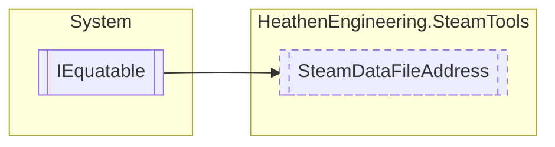

# SteamDataFileAddress `Public struct`

## Diagram


## Members
### Properties
#### Public  properties
| Type | Name | Methods |
| --- | --- | --- |
| `DateTime` | [`LocalTimestamp`](#localtimestamp) | `get, set` |

### Methods
#### Public Static methods
| Returns | Name |
| --- | --- |
| `bool` | `operator` [`!=`](#operator-)([`SteamDataFileAddress`](heathenengineeringsteamtools-SteamDataFileAddress) obj1, [`SteamDataFileAddress`](heathenengineeringsteamtools-SteamDataFileAddress) obj2) |
| `bool` | `operator` [`==`](#operator-)([`SteamDataFileAddress`](heathenengineeringsteamtools-SteamDataFileAddress) obj1, [`SteamDataFileAddress`](heathenengineeringsteamtools-SteamDataFileAddress) obj2) |

#### Public  methods
| Returns | Name |
| --- | --- |
| `bool` | [`Equals`](#equals-12)(`...`) |
| `int` | [`GetHashCode`](#gethashcode)() |

## Details
### Inheritance
 - `IEquatable`&lt;[`SteamDataFileAddress`](heathenengineeringsteamtools-SteamDataFileAddress)&gt;

### Methods
#### Operator ==
```csharp
public static bool operator ==(SteamDataFileAddress obj1, SteamDataFileAddress obj2)
```
##### Arguments
| Type | Name | Description |
| --- | --- | --- |
| [`SteamDataFileAddress`](heathenengineeringsteamtools-SteamDataFileAddress) | obj1 |   |
| [`SteamDataFileAddress`](heathenengineeringsteamtools-SteamDataFileAddress) | obj2 |   |

#### Operator !=
```csharp
public static bool operator !=(SteamDataFileAddress obj1, SteamDataFileAddress obj2)
```
##### Arguments
| Type | Name | Description |
| --- | --- | --- |
| [`SteamDataFileAddress`](heathenengineeringsteamtools-SteamDataFileAddress) | obj1 |   |
| [`SteamDataFileAddress`](heathenengineeringsteamtools-SteamDataFileAddress) | obj2 |   |

#### Equals [1/2]
```csharp
public virtual bool Equals(SteamDataFileAddress other)
```
##### Arguments
| Type | Name | Description |
| --- | --- | --- |
| [`SteamDataFileAddress`](heathenengineeringsteamtools-SteamDataFileAddress) | other |   |

#### Equals [2/2]
```csharp
public override bool Equals(object obj)
```
##### Arguments
| Type | Name | Description |
| --- | --- | --- |
| `object` | obj |   |

#### GetHashCode
```csharp
public override int GetHashCode()
```

### Properties
#### LocalTimestamp
```csharp
public DateTime LocalTimestamp { get; set; }
```

*Generated with* [*ModularDoc*](https://github.com/hailstorm75/ModularDoc)
