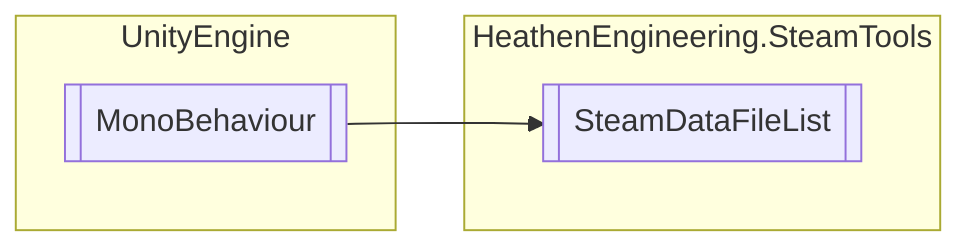

# SteamDataFileList `Public class`

## Diagram


## Members
### Properties
#### Public  properties
| Type | Name | Methods |
| --- | --- | --- |
| [`SteamDataFile`](./heathenengineeringsteamtools-SteamDataFile) | [`Active`](#active) | `get` |
| `Nullable`&lt;[`SteamDataFileAddress`](./heathenengineeringsteamtools-SteamDataFileAddress)&gt; | [`SelectedFile`](#selectedfile) | `get, set` |

### Methods
#### Public  methods
| Returns | Name |
| --- | --- |
| `void` | [`ClearSelected`](#clearselected)() |
| `void` | [`DeleteSelected`](#deleteselected)() |
| `void` | [`ForgetSelected`](#forgetselected)() |
| `Nullable`&lt;[`SteamDataFileAddress`](./heathenengineeringsteamtools-SteamDataFileAddress)&gt; | [`GetLatest`](#getlatest)() |
| `void` | [`LoadSelected`](#loadselected)() |
| `void` | [`LoadSelectedAsync`](#loadselectedasync)() |
| `void` | [`Refresh`](#refresh)() |
| `void` | [`SaveActive`](#saveactive)() |
| `void` | [`SaveActiveAsync`](#saveactiveasync)() |
| `void` | [`SaveAs`](#saveas-12)(`...`) |
| `void` | [`SaveAsAsync`](#saveasasync-12)(`...`) |
| `void` | [`Select`](#select)([`SteamDataFileAddress`](./heathenengineeringsteamtools-SteamDataFileAddress) address) |
| `void` | [`SelectLatest`](#selectlatest)() |

## Details
### Inheritance
 - `MonoBehaviour`

### Constructors
#### SteamDataFileList
```csharp
public SteamDataFileList()
```

### Methods
#### Refresh
```csharp
public void Refresh()
```

#### GetLatest
```csharp
public Nullable<SteamDataFileAddress> GetLatest()
```

#### ClearSelected
```csharp
public void ClearSelected()
```

#### Select
```csharp
public void Select(SteamDataFileAddress address)
```
##### Arguments
| Type | Name | Description |
| --- | --- | --- |
| [`SteamDataFileAddress`](./heathenengineeringsteamtools-SteamDataFileAddress) | address |   |

#### SelectLatest
```csharp
public void SelectLatest()
```

#### LoadSelected
```csharp
public void LoadSelected()
```

#### LoadSelectedAsync
```csharp
public void LoadSelectedAsync()
```

#### DeleteSelected
```csharp
public void DeleteSelected()
```

#### ForgetSelected
```csharp
public void ForgetSelected()
```

#### SaveActive
```csharp
public void SaveActive()
```

#### SaveAs [1/2]
```csharp
public void SaveAs(string fileName)
```
##### Arguments
| Type | Name | Description |
| --- | --- | --- |
| `string` | fileName |   |

#### SaveAs [2/2]
```csharp
public void SaveAs(InputField fileName)
```
##### Arguments
| Type | Name | Description |
| --- | --- | --- |
| `InputField` | fileName |   |

#### SaveActiveAsync
```csharp
public void SaveActiveAsync()
```

#### SaveAsAsync [1/2]
```csharp
public void SaveAsAsync(string fileName)
```
##### Arguments
| Type | Name | Description |
| --- | --- | --- |
| `string` | fileName |   |

#### SaveAsAsync [2/2]
```csharp
public void SaveAsAsync(InputField fileName)
```
##### Arguments
| Type | Name | Description |
| --- | --- | --- |
| `InputField` | fileName |   |

### Properties
#### Active
```csharp
public SteamDataFile Active { get; }
```

#### SelectedFile
```csharp
public Nullable<SteamDataFileAddress> SelectedFile { get; set; }
```

*Generated with* [*ModularDoc*](https://github.com/hailstorm75/ModularDoc)
