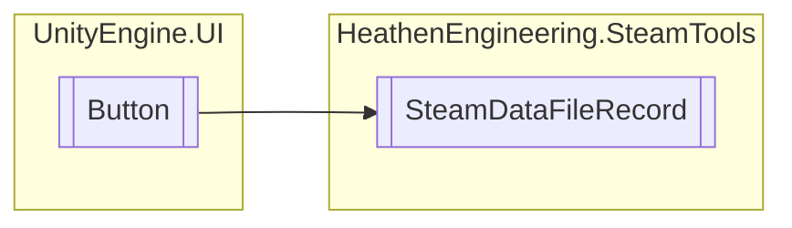

# SteamDataFileRecord `Public class`

## Diagram


## Members
### Methods
#### Protected  methods
| Returns | Name |
| --- | --- |
| `void` | [`Start`](#start)() |

## Details
### Inheritance
 - `Button`

### Constructors
#### SteamDataFileRecord
```csharp
public SteamDataFileRecord()
```

### Methods
#### Start
```csharp
protected override void Start()
```

*Generated with* [*ModularDoc*](https://github.com/hailstorm75/ModularDoc)
