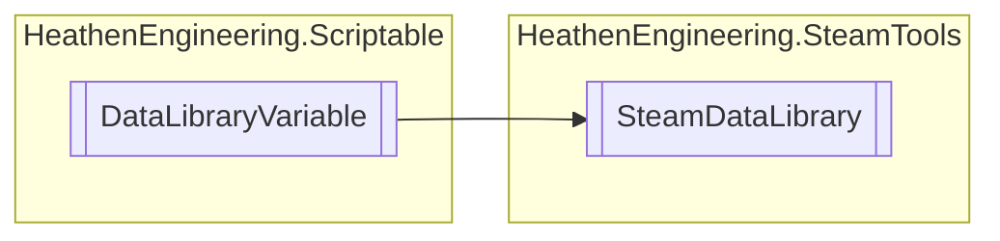

# SteamDataLibrary `Public class`

## Diagram


## Members
### Methods
#### Public  methods
| Returns | Name |
| --- | --- |
| `void` | [`Load`](#load-13)(`...`) |
| `void` | [`LoadAsync`](#loadasync-13)(`...`) |
| `void` | [`Save`](#save)() |
| `void` | [`SaveAs`](#saveas)(`string` fileName) |
| `void` | [`SaveAsAsync`](#saveasasync)(`string` fileName) |
| `void` | [`SaveAsync`](#saveasync)() |

## Details
### Inheritance
 - `DataLibraryVariable`

### Constructors
#### SteamDataLibrary
```csharp
public SteamDataLibrary()
```

### Methods
#### Save
```csharp
public void Save()
```

#### SaveAs
```csharp
public void SaveAs(string fileName)
```
##### Arguments
| Type | Name | Description |
| --- | --- | --- |
| `string` | fileName |   |

#### SaveAsync
```csharp
public void SaveAsync()
```

#### SaveAsAsync
```csharp
public void SaveAsAsync(string fileName)
```
##### Arguments
| Type | Name | Description |
| --- | --- | --- |
| `string` | fileName |   |

#### Load [1/3]
```csharp
public void Load()
```

#### LoadAsync [1/3]
```csharp
public void LoadAsync()
```

#### Load [2/3]
```csharp
public void Load(SteamDataFileAddress address)
```
##### Arguments
| Type | Name | Description |
| --- | --- | --- |
| [`SteamDataFileAddress`](./heathenengineeringsteamtools-SteamDataFileAddress) | address |   |

#### LoadAsync [2/3]
```csharp
public void LoadAsync(SteamDataFileAddress address)
```
##### Arguments
| Type | Name | Description |
| --- | --- | --- |
| [`SteamDataFileAddress`](./heathenengineeringsteamtools-SteamDataFileAddress) | address |   |

#### Load [3/3]
```csharp
public void Load(int availableFileIndex)
```
##### Arguments
| Type | Name | Description |
| --- | --- | --- |
| `int` | availableFileIndex |   |

#### LoadAsync [3/3]
```csharp
public void LoadAsync(int availableFileIndex)
```
##### Arguments
| Type | Name | Description |
| --- | --- | --- |
| `int` | availableFileIndex |   |

*Generated with* [*ModularDoc*](https://github.com/hailstorm75/ModularDoc)
