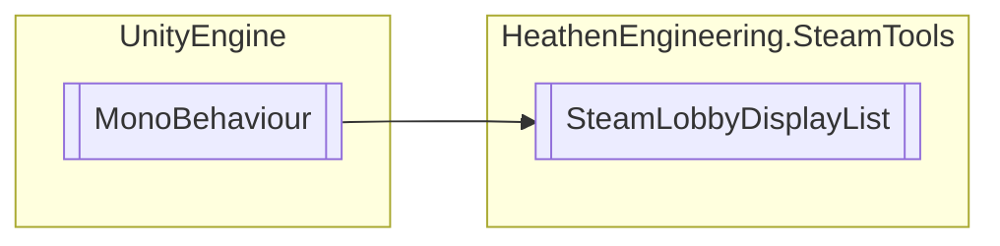

# SteamLobbyDisplayList `Public class`

## Diagram


## Members
### Methods
#### Public  methods
| Returns | Name |
| --- | --- |
| `void` | [`BrowseLobbies`](#browselobbies)() |
| `void` | [`QuickMatch`](#quickmatch-12)(`...`) |

## Details
### Inheritance
 - `MonoBehaviour`

### Constructors
#### SteamLobbyDisplayList
```csharp
public SteamLobbyDisplayList()
```

### Methods
#### QuickMatch [1/2]
```csharp
public void QuickMatch()
```

#### QuickMatch [2/2]
```csharp
public void QuickMatch(string onCreateName)
```
##### Arguments
| Type | Name | Description |
| --- | --- | --- |
| `string` | onCreateName |   |

#### BrowseLobbies
```csharp
public void BrowseLobbies()
```

*Generated with* [*ModularDoc*](https://github.com/hailstorm75/ModularDoc)
