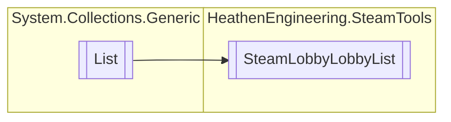

# SteamLobbyLobbyList `Public class`

## Diagram


## Details
### Inheritance
 - `List`&lt;[`LobbyHunterLobbyRecord`](./heathenengineeringsteamtools-LobbyHunterLobbyRecord)&gt;

### Constructors
#### SteamLobbyLobbyList
```csharp
public SteamLobbyLobbyList()
```

*Generated with* [*ModularDoc*](https://github.com/hailstorm75/ModularDoc)
