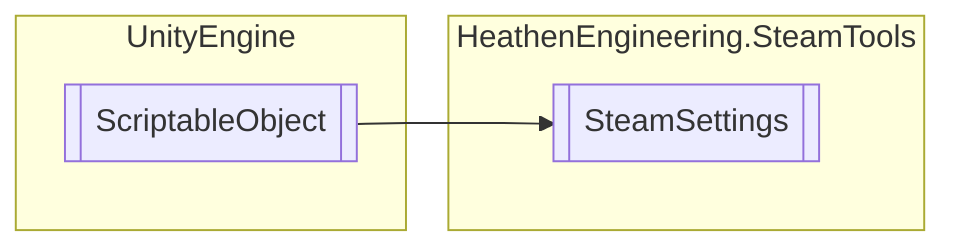

# SteamSettings `Public class`

## Diagram


## Members
### Methods
#### Public Static methods
| Returns | Name |
| --- | --- |
| `DateTime` | [`ConvertSteamTimeStamp`](#convertsteamtimestamp)(`uint` steamTime) |

#### Public  methods
| Returns | Name |
| --- | --- |
| [`SteamUserData`](./heathenengineeringsteamtools-SteamUserData) | [`GetUserData`](#getuserdata)(`CSteamID` steamID) |
| `void` | [`HandleOnOverlayOpen`](#handleonoverlayopen)(`GameOverlayActivated_t` data) |
| `bool` | [`ListenForFriendMessages`](#listenforfriendmessages)(`bool` isOn) |
| `void` | [`RefreshAvatar`](#refreshavatar)([`SteamUserData`](./heathenengineeringsteamtools-SteamUserData) userData) |
| `void` | [`RegisterAchievementsSystem`](#registerachievementssystem)() |
| `void` | [`RegisterFriendsSystem`](#registerfriendssystem)([`SteamUserData`](./heathenengineeringsteamtools-SteamUserData) data) |
| `bool` | [`RequestCurrentStats`](#requestcurrentstats)() |
| `bool` | [`SendFriendChatMessage`](#sendfriendchatmessage-13)(`...`) |
| `void` | [`SetNotificationInset`](#setnotificationinset-12)(`...`) |
| `void` | [`SetNotificationPosition`](#setnotificationposition)(`ENotificationPosition` position) |
| `void` | [`StoreStatsAndAchievements`](#storestatsandachievements)() |
| `void` | [`UnlockAchievement`](#unlockachievement)(`uint` achievementIndex) |
| `void` | [`UnlockAchievementData`](#unlockachievementdata)([`SteamAchievementData`](./heathenengineeringsteamtools-SteamAchievementData) data) |

## Details
### Inheritance
 - `ScriptableObject`

### Constructors
#### SteamSettings
```csharp
public SteamSettings()
```

### Methods
#### ConvertSteamTimeStamp
```csharp
public static DateTime ConvertSteamTimeStamp(uint steamTime)
```
##### Arguments
| Type | Name | Description |
| --- | --- | --- |
| `uint` | steamTime |   |

#### StoreStatsAndAchievements
```csharp
public void StoreStatsAndAchievements()
```

#### RegisterAchievementsSystem
```csharp
public void RegisterAchievementsSystem()
```

#### RequestCurrentStats
```csharp
public bool RequestCurrentStats()
```

#### UnlockAchievement
```csharp
public void UnlockAchievement(uint achievementIndex)
```
##### Arguments
| Type | Name | Description |
| --- | --- | --- |
| `uint` | achievementIndex |   |

#### UnlockAchievementData
```csharp
public void UnlockAchievementData(SteamAchievementData data)
```
##### Arguments
| Type | Name | Description |
| --- | --- | --- |
| [`SteamAchievementData`](./heathenengineeringsteamtools-SteamAchievementData) | data |   |

#### RegisterFriendsSystem
```csharp
public void RegisterFriendsSystem(SteamUserData data)
```
##### Arguments
| Type | Name | Description |
| --- | --- | --- |
| [`SteamUserData`](./heathenengineeringsteamtools-SteamUserData) | data |   |

#### ListenForFriendMessages
```csharp
public bool ListenForFriendMessages(bool isOn)
```
##### Arguments
| Type | Name | Description |
| --- | --- | --- |
| `bool` | isOn |   |

#### SendFriendChatMessage [1/3]
```csharp
public bool SendFriendChatMessage(SteamUserData friend, string message)
```
##### Arguments
| Type | Name | Description |
| --- | --- | --- |
| [`SteamUserData`](./heathenengineeringsteamtools-SteamUserData) | friend |   |
| `string` | message |   |

#### SendFriendChatMessage [2/3]
```csharp
public bool SendFriendChatMessage(ulong friendId, string message)
```
##### Arguments
| Type | Name | Description |
| --- | --- | --- |
| `ulong` | friendId |   |
| `string` | message |   |

#### SendFriendChatMessage [3/3]
```csharp
public bool SendFriendChatMessage(CSteamID friend, string message)
```
##### Arguments
| Type | Name | Description |
| --- | --- | --- |
| `CSteamID` | friend |   |
| `string` | message |   |

#### RefreshAvatar
```csharp
public void RefreshAvatar(SteamUserData userData)
```
##### Arguments
| Type | Name | Description |
| --- | --- | --- |
| [`SteamUserData`](./heathenengineeringsteamtools-SteamUserData) | userData |   |

#### GetUserData
```csharp
public SteamUserData GetUserData(CSteamID steamID)
```
##### Arguments
| Type | Name | Description |
| --- | --- | --- |
| `CSteamID` | steamID |   |

#### HandleOnOverlayOpen
```csharp
public void HandleOnOverlayOpen(GameOverlayActivated_t data)
```
##### Arguments
| Type | Name | Description |
| --- | --- | --- |
| `GameOverlayActivated_t` | data |   |

#### SetNotificationPosition
```csharp
public void SetNotificationPosition(ENotificationPosition position)
```
##### Arguments
| Type | Name | Description |
| --- | --- | --- |
| `ENotificationPosition` | position |   |

#### SetNotificationInset [1/2]
```csharp
public void SetNotificationInset(int X, int Y)
```
##### Arguments
| Type | Name | Description |
| --- | --- | --- |
| `int` | X |   |
| `int` | Y |   |

#### SetNotificationInset [2/2]
```csharp
public void SetNotificationInset(Vector2Int inset)
```
##### Arguments
| Type | Name | Description |
| --- | --- | --- |
| `Vector2Int` | inset |   |

*Generated with* [*ModularDoc*](https://github.com/hailstorm75/ModularDoc)
