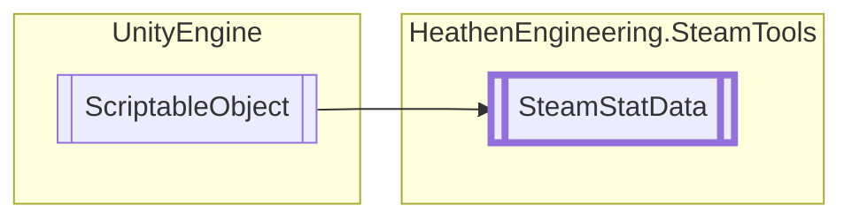

# SteamStatData `Public class`

## Diagram


## Members
### Properties
#### Public  properties
| Type | Name | Methods |
| --- | --- | --- |
| `StatDataType` | [`DataType`](#datatype) | `get` |

### Methods
#### Public  methods
| Returns | Name |
| --- | --- |
| `float` | [`GetFloatValue`](#getfloatvalue)() |
| `int` | [`GetIntValue`](#getintvalue)() |
| `void` | [`SetFloatStat`](#setfloatstat)(`float` value) |
| `void` | [`SetIntStat`](#setintstat)(`int` value) |
| `void` | [`UpdateValue`](#updatevalue-12)(`...`) |

## Details
### Inheritance
 - `ScriptableObject`

### Nested types
#### Enums
 - `StatDataType`

### Constructors
#### SteamStatData
```csharp
protected SteamStatData()
```

### Methods
#### UpdateValue [1/2]
```csharp
public abstract void UpdateValue(int value)
```
##### Arguments
| Type | Name | Description |
| --- | --- | --- |
| `int` | value |   |

#### UpdateValue [2/2]
```csharp
public abstract void UpdateValue(float value)
```
##### Arguments
| Type | Name | Description |
| --- | --- | --- |
| `float` | value |   |

#### GetIntValue
```csharp
public abstract int GetIntValue()
```

#### GetFloatValue
```csharp
public abstract float GetFloatValue()
```

#### SetIntStat
```csharp
public abstract void SetIntStat(int value)
```
##### Arguments
| Type | Name | Description |
| --- | --- | --- |
| `int` | value |   |

#### SetFloatStat
```csharp
public abstract void SetFloatStat(float value)
```
##### Arguments
| Type | Name | Description |
| --- | --- | --- |
| `float` | value |   |

### Properties
#### DataType
```csharp
public abstract StatDataType DataType { get; }
```

*Generated with* [*ModularDoc*](https://github.com/hailstorm75/ModularDoc)
