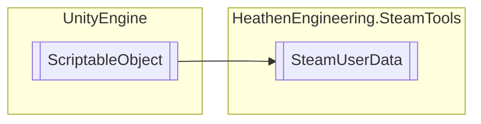

# SteamUserData `Public class`

## Diagram


## Members
### Methods
#### Public  methods
| Returns | Name |
| --- | --- |
| `void` | [`ClearData`](#cleardata)() |
| `void` | [`OpenAchievements`](#openachievements)() |
| `void` | [`OpenChat`](#openchat)() |
| `void` | [`OpenFriendAdd`](#openfriendadd)() |
| `void` | [`OpenFriendRemove`](#openfriendremove)() |
| `void` | [`OpenProfile`](#openprofile)() |
| `void` | [`OpenRequestAccept`](#openrequestaccept)() |
| `void` | [`OpenRequestIgnore`](#openrequestignore)() |
| `void` | [`OpenStats`](#openstats)() |
| `void` | [`OpenTrade`](#opentrade)() |
| `bool` | [`SendMessage`](#sendmessage)(`string` message) |

## Details
### Inheritance
 - `ScriptableObject`

### Constructors
#### SteamUserData
```csharp
public SteamUserData()
```

### Methods
#### ClearData
```csharp
public void ClearData()
```

#### OpenChat
```csharp
public void OpenChat()
```

#### OpenProfile
```csharp
public void OpenProfile()
```

#### OpenTrade
```csharp
public void OpenTrade()
```

#### OpenStats
```csharp
public void OpenStats()
```

#### OpenAchievements
```csharp
public void OpenAchievements()
```

#### OpenFriendAdd
```csharp
public void OpenFriendAdd()
```

#### OpenFriendRemove
```csharp
public void OpenFriendRemove()
```

#### OpenRequestAccept
```csharp
public void OpenRequestAccept()
```

#### OpenRequestIgnore
```csharp
public void OpenRequestIgnore()
```

#### SendMessage
```csharp
public bool SendMessage(string message)
```
##### Arguments
| Type | Name | Description |
| --- | --- | --- |
| `string` | message |   |

*Generated with* [*ModularDoc*](https://github.com/hailstorm75/ModularDoc)
