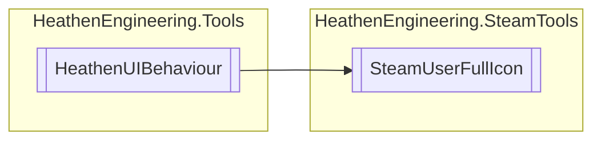

# SteamUserFullIcon `Public class`

## Diagram


## Members
### Methods
#### Public  methods
| Returns | Name |
| --- | --- |
| `void` | [`LinkSteamUser`](#linksteamuser)([`SteamUserData`](./heathenengineeringsteamtools-SteamUserData) newUserData) |

## Details
### Inheritance
 - `HeathenUIBehaviour`

### Constructors
#### SteamUserFullIcon
```csharp
public SteamUserFullIcon()
```

### Methods
#### LinkSteamUser
```csharp
public void LinkSteamUser(SteamUserData newUserData)
```
##### Arguments
| Type | Name | Description |
| --- | --- | --- |
| [`SteamUserData`](./heathenengineeringsteamtools-SteamUserData) | newUserData |   |

*Generated with* [*ModularDoc*](https://github.com/hailstorm75/ModularDoc)
