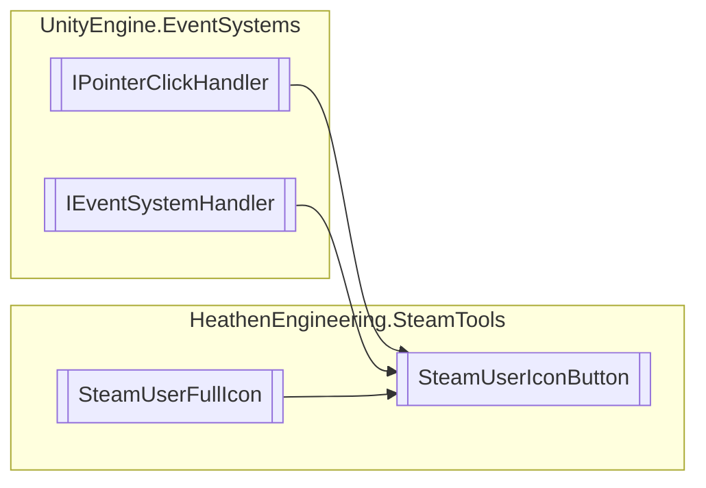

# SteamUserIconButton `Public class`

## Diagram


## Members
### Methods
#### Public  methods
| Returns | Name |
| --- | --- |
| `void` | [`OnPointerClick`](#onpointerclick)(`PointerEventData` eventData) |

## Details
### Inheritance
 - `IPointerClickHandler`
 - `IEventSystemHandler`
 - [
`SteamUserFullIcon`
](./heathenengineeringsteamtools-SteamUserFullIcon)

### Constructors
#### SteamUserIconButton
```csharp
public SteamUserIconButton()
```

### Methods
#### OnPointerClick
```csharp
public virtual void OnPointerClick(PointerEventData eventData)
```
##### Arguments
| Type | Name | Description |
| --- | --- | --- |
| `PointerEventData` | eventData |   |

*Generated with* [*ModularDoc*](https://github.com/hailstorm75/ModularDoc)
