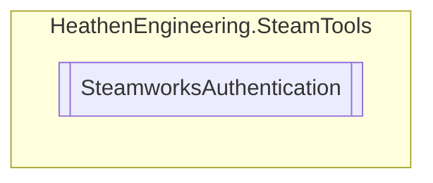

# SteamworksAuthentication `Public class`

## Diagram


## Members
### Methods
#### Public Static methods
| Returns | Name |
| --- | --- |
| `void` | [`BeginAuthSession`](#beginauthsession)(`byte``[]` authTicket, `CSteamID` user, `Action`&lt;`Session`&gt; callback) |
| `void` | [`CancelAuthTicket`](#cancelauthticket)(`Ticket` ticket) |
| `string` | [`EncodedAuthTicket`](#encodedauthticket)(`Ticket` ticket) |
| `void` | [`EndAuthSession`](#endauthsession)(`CSteamID` user) |
| `Ticket` | [`GetAuthSessionTicket`](#getauthsessionticket)() |
| `bool` | [`IsAuthTicketValid`](#isauthticketvalid)(`Ticket` ticket) |
| `bool` | [`RegisterCallbacks`](#registercallbacks)() |

## Details
### Nested types
#### Classes
 - `Session`
 - `Ticket`

### Methods
#### RegisterCallbacks
```csharp
public static bool RegisterCallbacks()
```

#### IsAuthTicketValid
```csharp
public static bool IsAuthTicketValid(Ticket ticket)
```
##### Arguments
| Type | Name | Description |
| --- | --- | --- |
| `Ticket` | ticket |   |

#### EncodedAuthTicket
```csharp
public static string EncodedAuthTicket(Ticket ticket)
```
##### Arguments
| Type | Name | Description |
| --- | --- | --- |
| `Ticket` | ticket |   |

#### GetAuthSessionTicket
```csharp
public static Ticket GetAuthSessionTicket()
```

#### CancelAuthTicket
```csharp
public static void CancelAuthTicket(Ticket ticket)
```
##### Arguments
| Type | Name | Description |
| --- | --- | --- |
| `Ticket` | ticket |   |

#### BeginAuthSession
```csharp
public static void BeginAuthSession(byte[] authTicket, CSteamID user, Action<Session> callback)
```
##### Arguments
| Type | Name | Description |
| --- | --- | --- |
| `byte``[]` | authTicket |   |
| `CSteamID` | user |   |
| `Action`&lt;`Session`&gt; | callback |   |

#### EndAuthSession
```csharp
public static void EndAuthSession(CSteamID user)
```
##### Arguments
| Type | Name | Description |
| --- | --- | --- |
| `CSteamID` | user |   |

*Generated with* [*ModularDoc*](https://github.com/hailstorm75/ModularDoc)
