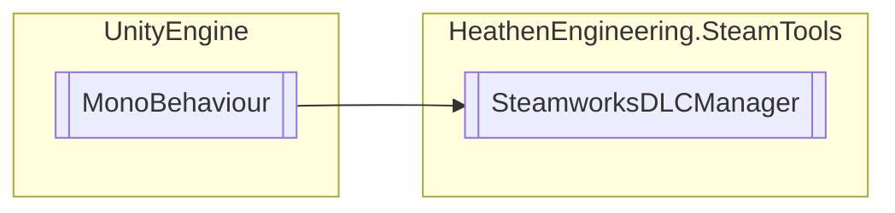

# SteamworksDLCManager `Public class`

## Diagram


## Members
### Methods
#### Public  methods
| Returns | Name |
| --- | --- |
| [`SteamDLCData`](./heathenengineeringsteamtools-SteamDLCData) | [`GetDLC`](#getdlc-12)(`...`) |
| `void` | [`UpdateAll`](#updateall)() |

## Details
### Inheritance
 - `MonoBehaviour`

### Constructors
#### SteamworksDLCManager
```csharp
public SteamworksDLCManager()
```

### Methods
#### UpdateAll
```csharp
public void UpdateAll()
```

#### GetDLC [1/2]
```csharp
public SteamDLCData GetDLC(AppId_t AppId)
```
##### Arguments
| Type | Name | Description |
| --- | --- | --- |
| `AppId_t` | AppId |   |

#### GetDLC [2/2]
```csharp
public SteamDLCData GetDLC(string name)
```
##### Arguments
| Type | Name | Description |
| --- | --- | --- |
| `string` | name |   |

*Generated with* [*ModularDoc*](https://github.com/hailstorm75/ModularDoc)
