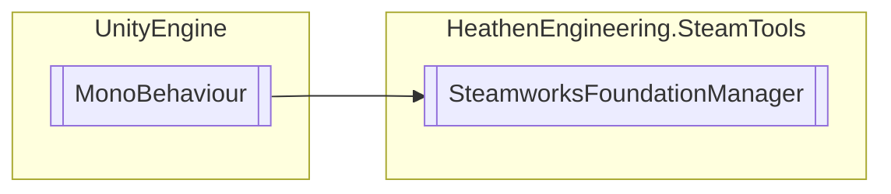

# SteamworksFoundationManager `Public class`

## Diagram


## Members
### Properties
#### Public Static properties
| Type | Name | Methods |
| --- | --- | --- |
| `bool` | [`Initialized`](#initialized) | `get` |
| [`SteamworksFoundationManager`](heathenengineeringsteamtools-SteamworksFoundationManager) | [`Instance`](#instance) | `get` |
| [`SteamUserData`](./heathenengineeringsteamtools-SteamUserData) | [`_UserData`](#userdata) | `get` |

#### Public  properties
| Type | Name | Methods |
| --- | --- | --- |
| [`SteamUserData`](./heathenengineeringsteamtools-SteamUserData) | [`UserData`](#userdata) | `get` |

### Methods
#### Public Static methods
| Returns | Name |
| --- | --- |
| `bool` | [`_AchievementExists`](#achievementexists-12)(`...`) |
| [`SteamAchievementData`](./heathenengineeringsteamtools-SteamAchievementData) | [`_GetAchievement`](#getachievement-12)(`...`) |
| `Texture2D` | [`_GetUserAvatar`](#getuseravatar-12)(`...`) |
| [`SteamUserData`](./heathenengineeringsteamtools-SteamUserData) | [`_GetUserData`](#getuserdata-12)(`...`) |
| `FriendGameInfo_t` | [`_GetUserGameInfo`](#getusergameinfo-12)(`...`) |
| `string` | [`_GetUserName`](#getusername-12)(`...`) |
| `bool` | [`_IsAchievementAchieved`](#isachievementachieved-12)(`...`) |
| `void` | [`_Open`](#open)(`string` dialog) |
| `void` | [`_OpenAchievements`](#openachievements-12)(`...`) |
| `void` | [`_OpenChat`](#openchat)([`SteamUserData`](./heathenengineeringsteamtools-SteamUserData) user) |
| `void` | [`_OpenCommunity`](#opencommunity)() |
| `void` | [`_OpenFriendAdd`](#openfriendadd)([`SteamUserData`](./heathenengineeringsteamtools-SteamUserData) user) |
| `void` | [`_OpenFriendRemove`](#openfriendremove)([`SteamUserData`](./heathenengineeringsteamtools-SteamUserData) user) |
| `void` | [`_OpenFriends`](#openfriends)() |
| `void` | [`_OpenOfficialGameGroup`](#openofficialgamegroup)() |
| `void` | [`_OpenPlayers`](#openplayers)() |
| `void` | [`_OpenProfile`](#openprofile)([`SteamUserData`](./heathenengineeringsteamtools-SteamUserData) user) |
| `void` | [`_OpenRequestAccept`](#openrequestaccept)([`SteamUserData`](./heathenengineeringsteamtools-SteamUserData) user) |
| `void` | [`_OpenRequestIgnore`](#openrequestignore)([`SteamUserData`](./heathenengineeringsteamtools-SteamUserData) user) |
| `void` | [`_OpenSettings`](#opensettings)() |
| `void` | [`_OpenStats`](#openstats-12)(`...`) |
| `void` | [`_OpenStore`](#openstore-14)(`...`) |
| `void` | [`_OpenTrade`](#opentrade)([`SteamUserData`](./heathenengineeringsteamtools-SteamUserData) user) |
| `void` | [`_OpenWebPage`](#openwebpage)(`string` URL) |
| `void` | [`_RefreshAvatar`](#refreshavatar)([`SteamUserData`](./heathenengineeringsteamtools-SteamUserData) userData) |
| `void` | [`_SetNotificationInset`](#setnotificationinset)(`Vector2Int` inset) |
| `void` | [`_SetNotificationPosition`](#setnotificationposition)(`ENotificationPosition` position) |
| `void` | [`_StoreStatsAndAchievements`](#storestatsandachievements)() |
| `void` | [`_UnlockAchievement`](#unlockachievement-13)(`...`) |

#### Public  methods
| Returns | Name |
| --- | --- |
| `bool` | [`AchievementExists`](#achievementexists-12)(`...`) |
| [`SteamAchievementData`](./heathenengineeringsteamtools-SteamAchievementData) | [`GetAchievement`](#getachievement-12)(`...`) |
| `Texture2D` | [`GetUserAvatar`](#getuseravatar-12)(`...`) |
| [`SteamUserData`](./heathenengineeringsteamtools-SteamUserData) | [`GetUserData`](#getuserdata-12)(`...`) |
| `FriendGameInfo_t` | [`GetUserGameInfo`](#getusergameinfo-12)(`...`) |
| `string` | [`GetUserName`](#getusername-12)(`...`) |
| `bool` | [`IsAchievementAchieved`](#isachievementachieved-12)(`...`) |
| `bool` | [`ListenForFriendMessages`](#listenforfriendmessages)(`bool` isOn) |
| `void` | [`Open`](#open)(`string` dialog) |
| `void` | [`OpenAchievements`](#openachievements-12)(`...`) |
| `void` | [`OpenChat`](#openchat)([`SteamUserData`](./heathenengineeringsteamtools-SteamUserData) user) |
| `void` | [`OpenCommunity`](#opencommunity)() |
| `void` | [`OpenFriendAdd`](#openfriendadd)([`SteamUserData`](./heathenengineeringsteamtools-SteamUserData) user) |
| `void` | [`OpenFriendRemove`](#openfriendremove)([`SteamUserData`](./heathenengineeringsteamtools-SteamUserData) user) |
| `void` | [`OpenFriends`](#openfriends)() |
| `void` | [`OpenOfficialGameGroup`](#openofficialgamegroup)() |
| `void` | [`OpenPlayers`](#openplayers)() |
| `void` | [`OpenProfile`](#openprofile)([`SteamUserData`](./heathenengineeringsteamtools-SteamUserData) user) |
| `void` | [`OpenRequestAccept`](#openrequestaccept)([`SteamUserData`](./heathenengineeringsteamtools-SteamUserData) user) |
| `void` | [`OpenRequestIgnore`](#openrequestignore)([`SteamUserData`](./heathenengineeringsteamtools-SteamUserData) user) |
| `void` | [`OpenSettings`](#opensettings)() |
| `void` | [`OpenStats`](#openstats-12)(`...`) |
| `void` | [`OpenStore`](#openstore-14)(`...`) |
| `void` | [`OpenTrade`](#opentrade)([`SteamUserData`](./heathenengineeringsteamtools-SteamUserData) user) |
| `void` | [`OpenWebPage`](#openwebpage)(`string` URL) |
| `void` | [`RefreshAvatar`](#refreshavatar)([`SteamUserData`](./heathenengineeringsteamtools-SteamUserData) userData) |
| `bool` | [`SendFriendChatMessage`](#sendfriendchatmessage-13)(`...`) |
| `void` | [`SetNotificationInset`](#setnotificationinset)(`Vector2Int` inset) |
| `void` | [`SetNotificationPosition`](#setnotificationposition)(`ENotificationPosition` position) |
| `void` | [`StoreStatsAndAchievements`](#storestatsandachievements)() |
| `void` | [`UnlockAchievement`](#unlockachievement-13)(`...`) |

## Details
### Inheritance
 - `MonoBehaviour`

### Constructors
#### SteamworksFoundationManager
```csharp
public SteamworksFoundationManager()
```

### Methods
#### _SetNotificationPosition
```csharp
public static void _SetNotificationPosition(ENotificationPosition position)
```
##### Arguments
| Type | Name | Description |
| --- | --- | --- |
| `ENotificationPosition` | position |   |

#### _SetNotificationInset
```csharp
public static void _SetNotificationInset(Vector2Int inset)
```
##### Arguments
| Type | Name | Description |
| --- | --- | --- |
| `Vector2Int` | inset |   |

#### _OpenStore [1/4]
```csharp
public static void _OpenStore()
```

#### _OpenStore [2/4]
```csharp
public static void _OpenStore(uint appId)
```
##### Arguments
| Type | Name | Description |
| --- | --- | --- |
| `uint` | appId |   |

#### _OpenStore [3/4]
```csharp
public static void _OpenStore(uint appId, EOverlayToStoreFlag flag)
```
##### Arguments
| Type | Name | Description |
| --- | --- | --- |
| `uint` | appId |   |
| `EOverlayToStoreFlag` | flag |   |

#### _OpenStore [4/4]
```csharp
public static void _OpenStore(AppId_t appId, EOverlayToStoreFlag flag)
```
##### Arguments
| Type | Name | Description |
| --- | --- | --- |
| `AppId_t` | appId |   |
| `EOverlayToStoreFlag` | flag |   |

#### _Open
```csharp
public static void _Open(string dialog)
```
##### Arguments
| Type | Name | Description |
| --- | --- | --- |
| `string` | dialog |   |

#### _OpenWebPage
```csharp
public static void _OpenWebPage(string URL)
```
##### Arguments
| Type | Name | Description |
| --- | --- | --- |
| `string` | URL |   |

#### _OpenFriends
```csharp
public static void _OpenFriends()
```

#### _OpenCommunity
```csharp
public static void _OpenCommunity()
```

#### _OpenPlayers
```csharp
public static void _OpenPlayers()
```

#### _OpenSettings
```csharp
public static void _OpenSettings()
```

#### _OpenOfficialGameGroup
```csharp
public static void _OpenOfficialGameGroup()
```

#### _OpenStats [1/2]
```csharp
public static void _OpenStats()
```

#### _OpenAchievements [1/2]
```csharp
public static void _OpenAchievements()
```

#### _OpenChat
```csharp
public static void _OpenChat(SteamUserData user)
```
##### Arguments
| Type | Name | Description |
| --- | --- | --- |
| [`SteamUserData`](./heathenengineeringsteamtools-SteamUserData) | user |   |

#### _OpenProfile
```csharp
public static void _OpenProfile(SteamUserData user)
```
##### Arguments
| Type | Name | Description |
| --- | --- | --- |
| [`SteamUserData`](./heathenengineeringsteamtools-SteamUserData) | user |   |

#### _OpenTrade
```csharp
public static void _OpenTrade(SteamUserData user)
```
##### Arguments
| Type | Name | Description |
| --- | --- | --- |
| [`SteamUserData`](./heathenengineeringsteamtools-SteamUserData) | user |   |

#### _OpenStats [2/2]
```csharp
public static void _OpenStats(SteamUserData user)
```
##### Arguments
| Type | Name | Description |
| --- | --- | --- |
| [`SteamUserData`](./heathenengineeringsteamtools-SteamUserData) | user |   |

#### _OpenAchievements [2/2]
```csharp
public static void _OpenAchievements(SteamUserData user)
```
##### Arguments
| Type | Name | Description |
| --- | --- | --- |
| [`SteamUserData`](./heathenengineeringsteamtools-SteamUserData) | user |   |

#### _OpenFriendAdd
```csharp
public static void _OpenFriendAdd(SteamUserData user)
```
##### Arguments
| Type | Name | Description |
| --- | --- | --- |
| [`SteamUserData`](./heathenengineeringsteamtools-SteamUserData) | user |   |

#### _OpenFriendRemove
```csharp
public static void _OpenFriendRemove(SteamUserData user)
```
##### Arguments
| Type | Name | Description |
| --- | --- | --- |
| [`SteamUserData`](./heathenengineeringsteamtools-SteamUserData) | user |   |

#### _OpenRequestAccept
```csharp
public static void _OpenRequestAccept(SteamUserData user)
```
##### Arguments
| Type | Name | Description |
| --- | --- | --- |
| [`SteamUserData`](./heathenengineeringsteamtools-SteamUserData) | user |   |

#### _OpenRequestIgnore
```csharp
public static void _OpenRequestIgnore(SteamUserData user)
```
##### Arguments
| Type | Name | Description |
| --- | --- | --- |
| [`SteamUserData`](./heathenengineeringsteamtools-SteamUserData) | user |   |

#### SetNotificationPosition
```csharp
public void SetNotificationPosition(ENotificationPosition position)
```
##### Arguments
| Type | Name | Description |
| --- | --- | --- |
| `ENotificationPosition` | position |   |

#### SetNotificationInset
```csharp
public void SetNotificationInset(Vector2Int inset)
```
##### Arguments
| Type | Name | Description |
| --- | --- | --- |
| `Vector2Int` | inset |   |

#### OpenStore [1/4]
```csharp
public void OpenStore()
```

#### OpenStore [2/4]
```csharp
public void OpenStore(uint appId)
```
##### Arguments
| Type | Name | Description |
| --- | --- | --- |
| `uint` | appId |   |

#### OpenStore [3/4]
```csharp
public void OpenStore(uint appId, EOverlayToStoreFlag flag)
```
##### Arguments
| Type | Name | Description |
| --- | --- | --- |
| `uint` | appId |   |
| `EOverlayToStoreFlag` | flag |   |

#### OpenStore [4/4]
```csharp
public void OpenStore(AppId_t appId, EOverlayToStoreFlag flag)
```
##### Arguments
| Type | Name | Description |
| --- | --- | --- |
| `AppId_t` | appId |   |
| `EOverlayToStoreFlag` | flag |   |

#### Open
```csharp
public void Open(string dialog)
```
##### Arguments
| Type | Name | Description |
| --- | --- | --- |
| `string` | dialog |   |

#### OpenWebPage
```csharp
public void OpenWebPage(string URL)
```
##### Arguments
| Type | Name | Description |
| --- | --- | --- |
| `string` | URL |   |

#### OpenFriends
```csharp
public void OpenFriends()
```

#### OpenCommunity
```csharp
public void OpenCommunity()
```

#### OpenPlayers
```csharp
public void OpenPlayers()
```

#### OpenSettings
```csharp
public void OpenSettings()
```

#### OpenOfficialGameGroup
```csharp
public void OpenOfficialGameGroup()
```

#### OpenStats [1/2]
```csharp
public void OpenStats()
```

#### OpenAchievements [1/2]
```csharp
public void OpenAchievements()
```

#### OpenChat
```csharp
public void OpenChat(SteamUserData user)
```
##### Arguments
| Type | Name | Description |
| --- | --- | --- |
| [`SteamUserData`](./heathenengineeringsteamtools-SteamUserData) | user |   |

#### OpenProfile
```csharp
public void OpenProfile(SteamUserData user)
```
##### Arguments
| Type | Name | Description |
| --- | --- | --- |
| [`SteamUserData`](./heathenengineeringsteamtools-SteamUserData) | user |   |

#### OpenTrade
```csharp
public void OpenTrade(SteamUserData user)
```
##### Arguments
| Type | Name | Description |
| --- | --- | --- |
| [`SteamUserData`](./heathenengineeringsteamtools-SteamUserData) | user |   |

#### OpenStats [2/2]
```csharp
public void OpenStats(SteamUserData user)
```
##### Arguments
| Type | Name | Description |
| --- | --- | --- |
| [`SteamUserData`](./heathenengineeringsteamtools-SteamUserData) | user |   |

#### OpenAchievements [2/2]
```csharp
public void OpenAchievements(SteamUserData user)
```
##### Arguments
| Type | Name | Description |
| --- | --- | --- |
| [`SteamUserData`](./heathenengineeringsteamtools-SteamUserData) | user |   |

#### OpenFriendAdd
```csharp
public void OpenFriendAdd(SteamUserData user)
```
##### Arguments
| Type | Name | Description |
| --- | --- | --- |
| [`SteamUserData`](./heathenengineeringsteamtools-SteamUserData) | user |   |

#### OpenFriendRemove
```csharp
public void OpenFriendRemove(SteamUserData user)
```
##### Arguments
| Type | Name | Description |
| --- | --- | --- |
| [`SteamUserData`](./heathenengineeringsteamtools-SteamUserData) | user |   |

#### OpenRequestAccept
```csharp
public void OpenRequestAccept(SteamUserData user)
```
##### Arguments
| Type | Name | Description |
| --- | --- | --- |
| [`SteamUserData`](./heathenengineeringsteamtools-SteamUserData) | user |   |

#### OpenRequestIgnore
```csharp
public void OpenRequestIgnore(SteamUserData user)
```
##### Arguments
| Type | Name | Description |
| --- | --- | --- |
| [`SteamUserData`](./heathenengineeringsteamtools-SteamUserData) | user |   |

#### _GetUserName [1/2]
```csharp
public static string _GetUserName(ulong steamId)
```
##### Arguments
| Type | Name | Description |
| --- | --- | --- |
| `ulong` | steamId |   |

#### _GetUserGameInfo [1/2]
```csharp
public static FriendGameInfo_t _GetUserGameInfo(ulong steamId)
```
##### Arguments
| Type | Name | Description |
| --- | --- | --- |
| `ulong` | steamId |   |

#### _GetUserAvatar [1/2]
```csharp
public static Texture2D _GetUserAvatar(ulong steamId)
```
##### Arguments
| Type | Name | Description |
| --- | --- | --- |
| `ulong` | steamId |   |

#### _GetUserData [1/2]
```csharp
public static SteamUserData _GetUserData(ulong steamId)
```
##### Arguments
| Type | Name | Description |
| --- | --- | --- |
| `ulong` | steamId |   |

#### _GetUserName [2/2]
```csharp
public static string _GetUserName(CSteamID steamId)
```
##### Arguments
| Type | Name | Description |
| --- | --- | --- |
| `CSteamID` | steamId |   |

#### _GetUserGameInfo [2/2]
```csharp
public static FriendGameInfo_t _GetUserGameInfo(CSteamID steamId)
```
##### Arguments
| Type | Name | Description |
| --- | --- | --- |
| `CSteamID` | steamId |   |

#### _GetUserAvatar [2/2]
```csharp
public static Texture2D _GetUserAvatar(CSteamID steamId)
```
##### Arguments
| Type | Name | Description |
| --- | --- | --- |
| `CSteamID` | steamId |   |

#### _GetUserData [2/2]
```csharp
public static SteamUserData _GetUserData(CSteamID steamId)
```
##### Arguments
| Type | Name | Description |
| --- | --- | --- |
| `CSteamID` | steamId |   |

#### _RefreshAvatar
```csharp
public static void _RefreshAvatar(SteamUserData userData)
```
##### Arguments
| Type | Name | Description |
| --- | --- | --- |
| [`SteamUserData`](./heathenengineeringsteamtools-SteamUserData) | userData |   |

#### GetUserName [1/2]
```csharp
public string GetUserName(ulong steamId)
```
##### Arguments
| Type | Name | Description |
| --- | --- | --- |
| `ulong` | steamId |   |

#### GetUserGameInfo [1/2]
```csharp
public FriendGameInfo_t GetUserGameInfo(ulong steamId)
```
##### Arguments
| Type | Name | Description |
| --- | --- | --- |
| `ulong` | steamId |   |

#### GetUserAvatar [1/2]
```csharp
public Texture2D GetUserAvatar(ulong steamId)
```
##### Arguments
| Type | Name | Description |
| --- | --- | --- |
| `ulong` | steamId |   |

#### GetUserData [1/2]
```csharp
public SteamUserData GetUserData(ulong steamId)
```
##### Arguments
| Type | Name | Description |
| --- | --- | --- |
| `ulong` | steamId |   |

#### GetUserName [2/2]
```csharp
public string GetUserName(CSteamID steamId)
```
##### Arguments
| Type | Name | Description |
| --- | --- | --- |
| `CSteamID` | steamId |   |

#### GetUserGameInfo [2/2]
```csharp
public FriendGameInfo_t GetUserGameInfo(CSteamID steamId)
```
##### Arguments
| Type | Name | Description |
| --- | --- | --- |
| `CSteamID` | steamId |   |

#### GetUserAvatar [2/2]
```csharp
public Texture2D GetUserAvatar(CSteamID steamId)
```
##### Arguments
| Type | Name | Description |
| --- | --- | --- |
| `CSteamID` | steamId |   |

#### GetUserData [2/2]
```csharp
public SteamUserData GetUserData(CSteamID steamId)
```
##### Arguments
| Type | Name | Description |
| --- | --- | --- |
| `CSteamID` | steamId |   |

#### RefreshAvatar
```csharp
public void RefreshAvatar(SteamUserData userData)
```
##### Arguments
| Type | Name | Description |
| --- | --- | --- |
| [`SteamUserData`](./heathenengineeringsteamtools-SteamUserData) | userData |   |

#### ListenForFriendMessages
```csharp
public bool ListenForFriendMessages(bool isOn)
```
##### Arguments
| Type | Name | Description |
| --- | --- | --- |
| `bool` | isOn |   |

#### SendFriendChatMessage [1/3]
```csharp
public bool SendFriendChatMessage(SteamUserData friend, string message)
```
##### Arguments
| Type | Name | Description |
| --- | --- | --- |
| [`SteamUserData`](./heathenengineeringsteamtools-SteamUserData) | friend |   |
| `string` | message |   |

#### SendFriendChatMessage [2/3]
```csharp
public bool SendFriendChatMessage(ulong friendId, string message)
```
##### Arguments
| Type | Name | Description |
| --- | --- | --- |
| `ulong` | friendId |   |
| `string` | message |   |

#### SendFriendChatMessage [3/3]
```csharp
public bool SendFriendChatMessage(CSteamID friend, string message)
```
##### Arguments
| Type | Name | Description |
| --- | --- | --- |
| `CSteamID` | friend |   |
| `string` | message |   |

#### StoreStatsAndAchievements
```csharp
public void StoreStatsAndAchievements()
```

#### GetAchievement [1/2]
```csharp
public SteamAchievementData GetAchievement(string achievementId)
```
##### Arguments
| Type | Name | Description |
| --- | --- | --- |
| `string` | achievementId |   |

#### GetAchievement [2/2]
```csharp
public SteamAchievementData GetAchievement(int achievementIndex)
```
##### Arguments
| Type | Name | Description |
| --- | --- | --- |
| `int` | achievementIndex |   |

#### UnlockAchievement [1/3]
```csharp
public void UnlockAchievement(SteamAchievementData achievementData)
```
##### Arguments
| Type | Name | Description |
| --- | --- | --- |
| [`SteamAchievementData`](./heathenengineeringsteamtools-SteamAchievementData) | achievementData |   |

#### UnlockAchievement [2/3]
```csharp
public void UnlockAchievement(string achievementId)
```
##### Arguments
| Type | Name | Description |
| --- | --- | --- |
| `string` | achievementId |   |

#### UnlockAchievement [3/3]
```csharp
public void UnlockAchievement(int achievementIndex)
```
##### Arguments
| Type | Name | Description |
| --- | --- | --- |
| `int` | achievementIndex |   |

#### IsAchievementAchieved [1/2]
```csharp
public bool IsAchievementAchieved(string achievementId)
```
##### Arguments
| Type | Name | Description |
| --- | --- | --- |
| `string` | achievementId |   |

#### IsAchievementAchieved [2/2]
```csharp
public bool IsAchievementAchieved(int achievementIndex)
```
##### Arguments
| Type | Name | Description |
| --- | --- | --- |
| `int` | achievementIndex |   |

#### AchievementExists [1/2]
```csharp
public bool AchievementExists(string achievementId)
```
##### Arguments
| Type | Name | Description |
| --- | --- | --- |
| `string` | achievementId |   |

#### AchievementExists [2/2]
```csharp
public bool AchievementExists(int achievementIndex)
```
##### Arguments
| Type | Name | Description |
| --- | --- | --- |
| `int` | achievementIndex |   |

#### _StoreStatsAndAchievements
```csharp
public static void _StoreStatsAndAchievements()
```

#### _GetAchievement [1/2]
```csharp
public static SteamAchievementData _GetAchievement(string achievementId)
```
##### Arguments
| Type | Name | Description |
| --- | --- | --- |
| `string` | achievementId |   |

#### _GetAchievement [2/2]
```csharp
public static SteamAchievementData _GetAchievement(int achievementIndex)
```
##### Arguments
| Type | Name | Description |
| --- | --- | --- |
| `int` | achievementIndex |   |

#### _UnlockAchievement [1/3]
```csharp
public static void _UnlockAchievement(SteamAchievementData achievementData)
```
##### Arguments
| Type | Name | Description |
| --- | --- | --- |
| [`SteamAchievementData`](./heathenengineeringsteamtools-SteamAchievementData) | achievementData |   |

#### _UnlockAchievement [2/3]
```csharp
public static void _UnlockAchievement(string achievementId)
```
##### Arguments
| Type | Name | Description |
| --- | --- | --- |
| `string` | achievementId |   |

#### _UnlockAchievement [3/3]
```csharp
public static void _UnlockAchievement(int achievementIndex)
```
##### Arguments
| Type | Name | Description |
| --- | --- | --- |
| `int` | achievementIndex |   |

#### _IsAchievementAchieved [1/2]
```csharp
public static bool _IsAchievementAchieved(string achievementId)
```
##### Arguments
| Type | Name | Description |
| --- | --- | --- |
| `string` | achievementId |   |

#### _IsAchievementAchieved [2/2]
```csharp
public static bool _IsAchievementAchieved(int achievementIndex)
```
##### Arguments
| Type | Name | Description |
| --- | --- | --- |
| `int` | achievementIndex |   |

#### _AchievementExists [1/2]
```csharp
public static bool _AchievementExists(string achievementId)
```
##### Arguments
| Type | Name | Description |
| --- | --- | --- |
| `string` | achievementId |   |

#### _AchievementExists [2/2]
```csharp
public static bool _AchievementExists(int achievementIndex)
```
##### Arguments
| Type | Name | Description |
| --- | --- | --- |
| `int` | achievementIndex |   |

### Properties
#### Instance
```csharp
public static SteamworksFoundationManager Instance { get; }
```

#### Initialized
```csharp
public static bool Initialized { get; }
```

#### _UserData
```csharp
public static SteamUserData _UserData { get; }
```

#### UserData
```csharp
public SteamUserData UserData { get; }
```

*Generated with* [*ModularDoc*](https://github.com/hailstorm75/ModularDoc)
