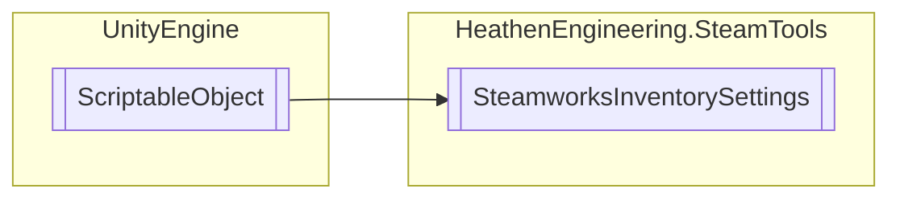

# SteamworksInventorySettings `Public class`

## Diagram


## Members
### Properties
#### Public  properties
| Type | Name | Methods |
| --- | --- | --- |
| `bool` | [`IsActive`](#isactive) | `get, set` |
| [`InventoryItemPointer`](./heathenengineeringsteamtools-InventoryItemPointer) | [`Item`](#item) | `get` |
| [`InventoryItemPointer`](./heathenengineeringsteamtools-InventoryItemPointer) | [`Item`](#item) | `get` |
| [`InventoryItemPointer`](./heathenengineeringsteamtools-InventoryItemPointer) | [`Item`](#item) | `get` |

### Methods
#### Public  methods
| Returns | Name |
| --- | --- |
| `void` | [`BuildIndex`](#buildindex)() |
| `bool` | [`CheckUserResult`](#checkuserresult-13)(`...`) |
| `void` | [`ClearItemCounts`](#clearitemcounts)() |
| `void` | [`Consolidate`](#consolidate)([`InventoryItemDefinition`](./heathenengineeringsteamtools-InventoryItemDefinition) item) |
| `void` | [`ConsumeItem`](#consumeitem-14)(`...`) |
| `void` | [`ExchangeItems`](#exchangeitems-12)(`...`) |
| `T` | [`GetDefinition`](#getdefinition-15)(`...`) |
| `void` | [`GrantAllPromotionalItems`](#grantallpromotionalitems)() |
| `void` | [`GrantPromotionalItem`](#grantpromotionalitem)([`InventoryItemDefinition`](./heathenengineeringsteamtools-InventoryItemDefinition) itemDefinition) |
| `void` | [`GrantPromotionalItems`](#grantpromotionalitems)(`IEnumerable`&lt;[`InventoryItemDefinition`](./heathenengineeringsteamtools-InventoryItemDefinition)&gt; itemDefinitions) |
| `void` | [`HandleItemDetailUpdate`](#handleitemdetailupdate)(`IEnumerable`&lt;`SteamItemDetails_t`&gt; details) |
| `void` | [`RefreshInventory`](#refreshinventory)() |
| `void` | [`Register`](#register)() |
| `bool` | [`SplitInstance`](#splitinstance)([`InventoryItemDefinition`](./heathenengineeringsteamtools-InventoryItemDefinition) item, `SteamItemDetails_t` source, `uint` quantity) |
| `bool` | [`StackInstance`](#stackinstance)([`InventoryItemDefinition`](./heathenengineeringsteamtools-InventoryItemDefinition) item, `SteamItemDetails_t` source, `SteamItemInstanceID_t` destination) |
| `bool` | [`TransferQuantity`](#transferquantity)([`InventoryItemDefinition`](./heathenengineeringsteamtools-InventoryItemDefinition) item, `SteamItemDetails_t` source, `uint` quantity, `SteamItemInstanceID_t` destination) |
| `void` | [`TriggerItemDrop`](#triggeritemdrop-12)(`...`) |
| `void` | [`TriggerItemDropAndRefresh`](#triggeritemdropandrefresh)([`ItemGeneratorDefinition`](./heathenengineeringsteamtools-ItemGeneratorDefinition) generator) |

#### Public Static methods
| Returns | Name |
| --- | --- |
| `void` | [`InternalItemDetailUpdate`](#internalitemdetailupdate)(`IEnumerable`&lt;`SteamItemDetails_t`&gt; details) |

## Details
### Inheritance
 - `ScriptableObject`

### Constructors
#### SteamworksInventorySettings
```csharp
public SteamworksInventorySettings()
```

### Methods
#### BuildIndex
```csharp
public void BuildIndex()
```

#### ClearItemCounts
```csharp
public void ClearItemCounts()
```

#### InternalItemDetailUpdate
```csharp
public static void InternalItemDetailUpdate(IEnumerable<SteamItemDetails_t> details)
```
##### Arguments
| Type | Name | Description |
| --- | --- | --- |
| `IEnumerable`&lt;`SteamItemDetails_t`&gt; | details |   |

#### HandleItemDetailUpdate
```csharp
public void HandleItemDetailUpdate(IEnumerable<SteamItemDetails_t> details)
```
##### Arguments
| Type | Name | Description |
| --- | --- | --- |
| `IEnumerable`&lt;`SteamItemDetails_t`&gt; | details |   |

#### Register
```csharp
public void Register()
```

#### GetDefinition [1/5]
```csharp
public T GetDefinition<T>(SteamItemDetails_t steamDetail)
where T : InventoryItemDefinition
```
##### Arguments
| Type | Name | Description |
| --- | --- | --- |
| `SteamItemDetails_t` | steamDetail |   |

#### GetDefinition [2/5]
```csharp
public T GetDefinition<T>(SteamItemDef_t steamDefinition)
where T : InventoryItemDefinition
```
##### Arguments
| Type | Name | Description |
| --- | --- | --- |
| `SteamItemDef_t` | steamDefinition |   |

#### GetDefinition [3/5]
```csharp
public InventoryItemDefinition GetDefinition(SteamItemDetails_t steamDetail)
```
##### Arguments
| Type | Name | Description |
| --- | --- | --- |
| `SteamItemDetails_t` | steamDetail |   |

#### GetDefinition [4/5]
```csharp
public InventoryItemDefinition GetDefinition(SteamItemDef_t steamDefinition)
```
##### Arguments
| Type | Name | Description |
| --- | --- | --- |
| `SteamItemDef_t` | steamDefinition |   |

#### GetDefinition [5/5]
```csharp
public InventoryItemDefinition GetDefinition(int steamDefinition)
```
##### Arguments
| Type | Name | Description |
| --- | --- | --- |
| `int` | steamDefinition |   |

#### RefreshInventory
```csharp
public void RefreshInventory()
```

#### GrantAllPromotionalItems
```csharp
public void GrantAllPromotionalItems()
```

#### GrantPromotionalItem
```csharp
public void GrantPromotionalItem(InventoryItemDefinition itemDefinition)
```
##### Arguments
| Type | Name | Description |
| --- | --- | --- |
| [`InventoryItemDefinition`](./heathenengineeringsteamtools-InventoryItemDefinition) | itemDefinition |   |

#### GrantPromotionalItems
```csharp
public void GrantPromotionalItems(IEnumerable<InventoryItemDefinition> itemDefinitions)
```
##### Arguments
| Type | Name | Description |
| --- | --- | --- |
| `IEnumerable`&lt;[`InventoryItemDefinition`](./heathenengineeringsteamtools-InventoryItemDefinition)&gt; | itemDefinitions |   |

#### CheckUserResult [1/3]
```csharp
public bool CheckUserResult(SteamInventoryResult_t resultHandle, ulong user)
```
##### Arguments
| Type | Name | Description |
| --- | --- | --- |
| `SteamInventoryResult_t` | resultHandle |   |
| `ulong` | user |   |

#### CheckUserResult [2/3]
```csharp
public bool CheckUserResult(SteamInventoryResult_t resultHandle, CSteamID user)
```
##### Arguments
| Type | Name | Description |
| --- | --- | --- |
| `SteamInventoryResult_t` | resultHandle |   |
| `CSteamID` | user |   |

#### CheckUserResult [3/3]
```csharp
public bool CheckUserResult(SteamInventoryResult_t resultHandle, SteamUserData user)
```
##### Arguments
| Type | Name | Description |
| --- | --- | --- |
| `SteamInventoryResult_t` | resultHandle |   |
| [`SteamUserData`](./heathenengineeringsteamtools-SteamUserData) | user |   |

#### ConsumeItem [1/4]
```csharp
public void ConsumeItem(InventoryItemDefinition itemDefinition)
```
##### Arguments
| Type | Name | Description |
| --- | --- | --- |
| [`InventoryItemDefinition`](./heathenengineeringsteamtools-InventoryItemDefinition) | itemDefinition |   |

#### ConsumeItem [2/4]
```csharp
public void ConsumeItem(InventoryItemDefinition itemDefinition, int count)
```
##### Arguments
| Type | Name | Description |
| --- | --- | --- |
| [`InventoryItemDefinition`](./heathenengineeringsteamtools-InventoryItemDefinition) | itemDefinition |   |
| `int` | count |   |

#### ConsumeItem [3/4]
```csharp
public void ConsumeItem(InventoryItemDefinition itemDefinition, SteamItemInstanceID_t instanceId, int count)
```
##### Arguments
| Type | Name | Description |
| --- | --- | --- |
| [`InventoryItemDefinition`](./heathenengineeringsteamtools-InventoryItemDefinition) | itemDefinition |   |
| `SteamItemInstanceID_t` | instanceId |   |
| `int` | count |   |

#### ConsumeItem [4/4]
```csharp
public void ConsumeItem(SteamItemInstanceID_t instanceId, int count)
```
##### Arguments
| Type | Name | Description |
| --- | --- | --- |
| `SteamItemInstanceID_t` | instanceId |   |
| `int` | count |   |

#### ExchangeItems [1/2]
```csharp
public void ExchangeItems(InventoryItemDefinition itemToCraft, CraftingRecipe recipe)
```
##### Arguments
| Type | Name | Description |
| --- | --- | --- |
| [`InventoryItemDefinition`](./heathenengineeringsteamtools-InventoryItemDefinition) | itemToCraft |   |
| [`CraftingRecipe`](./heathenengineeringsteamtools-CraftingRecipe) | recipe |   |

#### ExchangeItems [2/2]
```csharp
public void ExchangeItems(InventoryItemDefinition itemToCraft, int recipeIndex)
```
##### Arguments
| Type | Name | Description |
| --- | --- | --- |
| [`InventoryItemDefinition`](./heathenengineeringsteamtools-InventoryItemDefinition) | itemToCraft |   |
| `int` | recipeIndex |   |

#### TriggerItemDrop [1/2]
```csharp
public void TriggerItemDrop(ItemGeneratorDefinition generator, bool postDropRefresh)
```
##### Arguments
| Type | Name | Description |
| --- | --- | --- |
| [`ItemGeneratorDefinition`](./heathenengineeringsteamtools-ItemGeneratorDefinition) | generator |   |
| `bool` | postDropRefresh |   |

#### TriggerItemDrop [2/2]
```csharp
public void TriggerItemDrop(ItemGeneratorDefinition generator)
```
##### Arguments
| Type | Name | Description |
| --- | --- | --- |
| [`ItemGeneratorDefinition`](./heathenengineeringsteamtools-ItemGeneratorDefinition) | generator |   |

#### TriggerItemDropAndRefresh
```csharp
public void TriggerItemDropAndRefresh(ItemGeneratorDefinition generator)
```
##### Arguments
| Type | Name | Description |
| --- | --- | --- |
| [`ItemGeneratorDefinition`](./heathenengineeringsteamtools-ItemGeneratorDefinition) | generator |   |

#### TransferQuantity
```csharp
public bool TransferQuantity(InventoryItemDefinition item, SteamItemDetails_t source, uint quantity, SteamItemInstanceID_t destination)
```
##### Arguments
| Type | Name | Description |
| --- | --- | --- |
| [`InventoryItemDefinition`](./heathenengineeringsteamtools-InventoryItemDefinition) | item |   |
| `SteamItemDetails_t` | source |   |
| `uint` | quantity |   |
| `SteamItemInstanceID_t` | destination |   |

#### SplitInstance
```csharp
public bool SplitInstance(InventoryItemDefinition item, SteamItemDetails_t source, uint quantity)
```
##### Arguments
| Type | Name | Description |
| --- | --- | --- |
| [`InventoryItemDefinition`](./heathenengineeringsteamtools-InventoryItemDefinition) | item |   |
| `SteamItemDetails_t` | source |   |
| `uint` | quantity |   |

#### StackInstance
```csharp
public bool StackInstance(InventoryItemDefinition item, SteamItemDetails_t source, SteamItemInstanceID_t destination)
```
##### Arguments
| Type | Name | Description |
| --- | --- | --- |
| [`InventoryItemDefinition`](./heathenengineeringsteamtools-InventoryItemDefinition) | item |   |
| `SteamItemDetails_t` | source |   |
| `SteamItemInstanceID_t` | destination |   |

#### Consolidate
```csharp
public void Consolidate(InventoryItemDefinition item)
```
##### Arguments
| Type | Name | Description |
| --- | --- | --- |
| [`InventoryItemDefinition`](./heathenengineeringsteamtools-InventoryItemDefinition) | item |   |

### Properties
#### IsActive
```csharp
public bool IsActive { get; set; }
```

#### Item
```csharp
public InventoryItemPointer Item { get; }
```

#### Item
```csharp
public InventoryItemPointer Item { get; }
```

#### Item
```csharp
public InventoryItemPointer Item { get; }
```

*Generated with* [*ModularDoc*](https://github.com/hailstorm75/ModularDoc)
